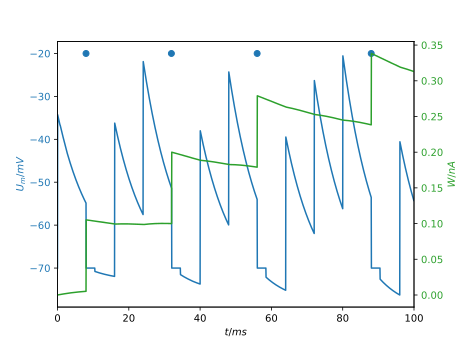

.. _adexcell:

AdEx cells
===========

The Adaptive Exponential point neuron type follows two coupled differential
equations with an explicit refractory period.
See for example

.. code-block::

   Self-sustained asynchronous irregular states and Up–Down states
   in thalamic, cortical and thalamocortical networks of nonlinear
   integrate-and-fire neurons

   A. Destexhe 2009

Outside the refractory period the dynamics are

.. math::
   C_m\partial_t V_m = -g(V_m - E_L) + g \Delta \exp\left(\frac{V_m - V_\mathrm{th}{\Delta}\right) - w + I\\
   \partial_t w   = a(V_m - E_L) - w + f

with the following terms and their default/starting values

* Membrane potential :math:`V_\mathrm{m}`, by default :math:`V_\mathrm{m}(t=0) = E_\mathrm{L}`
* Resting potential :math:`E_\mathrm{L} = -70\,mV`
* Reset potential :math:`E_\mathrm{R}`, by default :math:`E_\mathrm{R} = E_\mathrm{L}`
* Membrane potential steepness parameter :math:`\Delta = 2.5\,mV`
* Membrane capacitance :math:`C_\mathrm{m} = 0.28\,nF`
* Firing threshold :math:`V_\mathrm{th} = -20\,mV`
* Refractory period :math:`t_\mathrm{ref} = 2.5\,ms`
* Leak conductivity :math:`g = 0.03\,mu S`

and

* adaptivity parameter :math:`w = 0\,nA`
* decay time :math:`\tau = 144\,ms`
* :math:`a = 0.004\,\mu S`
* :math:`b = 0.08\,nA`

Incoming spikes give rise to a instantaneous jump in the membrane potential
:math:`V_m \rightarrow V_m + \frac{\omega}{C_m}`, i.e. :math:`I` is a delta
functional.

Every time :math:`t_s` the cell emits a spike, :math:`w` is incremented by :math:`b`; thus
:math:`f(t) = b\delta(t-t_s)` and the refractory begins, for a duration of
:math:`t_\mathrm{ref}`. During that time

.. math::
   V_m = E_R\\
   \partial_t w   = a(V_m - E_L) - w

and all incoming spikes are discarded without effect.

The morphology of a AdEx cell is implicitly modelled as a single
:term:`compartment <control volume>`; each cell has one built-in **source** and
one built-in **target** which need to be given labels when the cell is created.
The labels are used to form connections to and from the cell. AdEx cells do
neither support additional **sources** or **targets**, nor **gap junctions**.
They do not support adding density or point mechanisms.

AdEx cells can be probed to obtain their current membrane potential and
adaptivity parameter values, see :ref:`probesample`.

    Plot of :math:`V_m` and :math:`w` over time for an AdEx cell.

API
---

* :ref:`Python <pyadexcell>`
* :ref:`C++ <cppadexcell>`
