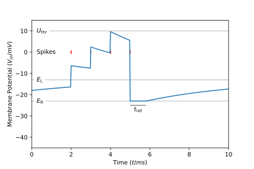

.. _lifcell:

LIF cells
===========

The description of a LIF cell is used to control the leaky integrate-and-fire dynamics:

* Starting potential :math:`V_\mathrm{0}`, by default :math:`V_\mathrm{0} = E_\mathrm{L}`
* Resting potential :math:`E_\mathrm{L}`
* Reset potential :math:`E_\mathrm{R}`, by default :math:`E_\mathrm{R} = E_\mathrm{L}`
* Membrane potential decaying constant :math:`\tau_\mathrm{m}`
* Membrane capacitance :math:`C_\mathrm{m}`
* Firing threshold :math:`U_\mathrm{threshold}`
* Refractory period :math:`t_\mathrm{ref}`

The morphology of a LIF cell is automatically modelled as a single
:term:`compartment <control volume>`; each cell has one built-in **source** and
one built-in **target** which need to be given labels when the cell is created.
The labels are used to form connections to and from the cell. LIF cells do not
support adding additional **sources** or **targets** to the description. They do
not support **gap junctions**. They do not support adding density or point
mechanisms.

The LIF cell's time dynamics are this:

0. :math:`U_\mathrm{m}(0) = V_\mathrm{0}`,
1. If the cell is in its refractory state :math:`U_\mathrm{m}(t) = E_\mathrm{R}`
2. Otherwise
   :math:`U'_\mathrm{m}(t) = \sum\limits_\mathrm{spike} w_\mathrm{spike}\cdot\delta(t - t_\mathrm{spike}) - \frac{1}{\tau_\mathrm{m}}\left(U_\mathrm{m}(t)) - E_\mathrm{L}\right)`
   where :math:`w_\mathrm{spike}` represents the weight of the synaptic connection associated with the given spike event.
3. If :math:`U_\mathrm{m}(t_0) \geq U_\mathrm{threshold}`: emit spike and enter refractory period until :math:`t = t_0 + t_\mathrm{ref}`

LIF cells can be probed to obtain their current membrane potential, see :ref:`probesample`.

    Plot of the potential over time for a LIF cell.

API
---

* :ref:`Python <pylifcell>`
* :ref:`C++ <cpplifcell>`
