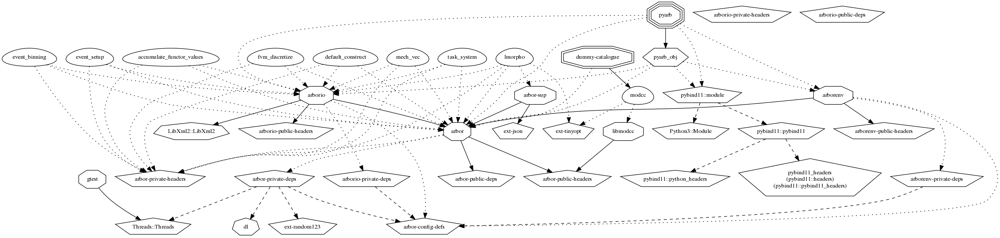

.. _dev-overview:

Developers Guide
================

Here we document internal components of Arbor. These pages can be useful if you're interested in developing on Arbor itself.

   Arbor dependency graph. To see what dependencies Arbor has and how to generate this figure, see :ref:`contribdepverman`.

.. toctree::
   :caption: Arbor Developers Guide:
   :maxdepth: 2

   cable_cell
   cell_groups
   communication
   debug
   matrix_solver
   sde
   simd_api
   shared_state
   export
   extending_catalogues
   mechanism_abi
   util
   version
   numerics
