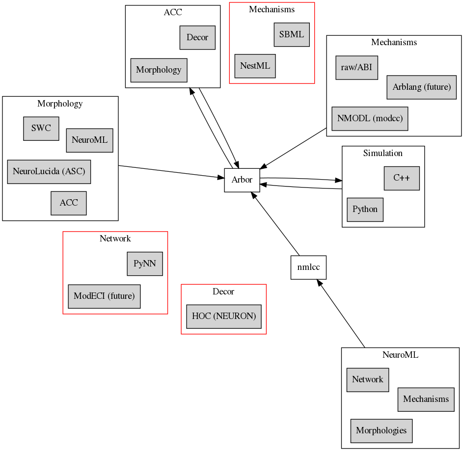

.. _ecosystemindex:

Ecosystem
=========

Arbor exists in a wider computational neuroscience software ecosystem. In addition to the Arbor simulator, the Arbor development team writes and maintains a set of useful tools to be used in conjuction with Arbor.

Arbor models
------------

We try to collect models scientists have built in our `contributor space <https://github.com/arbor-contrib/>`_.
In addition to the tutorials, browsing these models should give you a good idea of what's possible with Arbor
and find get in contact with other Arbor users.

Arbor software
--------------

Arbor
    The Arbor simulator.

modcc
    An important component of Arbor. It is the compiler for the Arbor dialect of `NMODL`, a language commonly used to describe mechanisms on morphologically detailed cable cells. `modcc` does not have its own documentation; the best resource is the file format page describing it :ref:`formatnmodl`.

NSuite
    A framework for maintaining and running benchmarks and validation tests for multi-compartment neural network simulations on HPC systems. `NSuite documentation <https://nsuite.readthedocs.io>`_

Arbor GUI
    The Arbor GUI visualizes cable cells and can be used to decorate morphologies. Single cell simulations can be ran (using the Arbor simulator) and output plotted right from the GUI. `Code repository and Readme <https://github.com/arbor-sim/gui>`_

nmlcc
    Arbor has built-in read support for NeuroML morphologies, but not yet for other NeuroML components (mechanisms, networks). `nmlcc` is compiler/translator that aims to generate complete Arbor inputs for any NeuroML file. `Code repository and Readme <https://github.com/thorstenhater/nmlcc/>`_

   Arbor tools in relationship to each other and common file formats. Red outlines indicate currently unplanned format format support (figure generated from ``arbor.dot``).

Wider ecosystem
---------------

A list of tools in the computational neuroscience ecosystem is being maintained at `compneuroweb <https://compneuroweb.com/sftwr.html>`_. We've made a slightly more hierarchical overview of some of the simulators below, as well as an overview of some commonly used frameworks.

Simulators
~~~~~~~~~~

Arbor exists in the wider computational neuroscience simulator ecosystem. Simulators exist roughly at these four levels: ranging from the lowest level (molecular dynamics) to the highest (whole brain simulation). Needless to say, each level comes with a higher level of abstraction, but attempt to describe larger structures. Co-simulation or Multiscale simulations refers to the attempt to link up the levels and simulators in an attempt to combine the low level of detail (in regions where it is desired) with the effects of the larger structures. The concrete method to interface between levels are typically the submission of spikes, ion (concentrations), field potentials.

.. raw:: html
   :file: index-sims.html

Frameworks
~~~~~~~~~~

Certain tools combine various components to create integrated experimentation toolchains. They do not only include (interfaces for) simulators, but also converters for file formats, miscellaneous data processing (pre or post), plotting, miscellaneous analysis, and more. An incomplete list:

- `NeuroMLlite <https://github.com/NeuroML/NeuroMLlite>`_ (NML)
- `OpenSourceBrain <https://www.opensourcebrain.org>`_ (NML2)
- `jNeuroML, pyNeuroML, jLEMS, pyLEMS <https://docs.neuroml.org>`_ (NML2)
- `BMTK / SONATA <https://alleninstitute.github.io/bmtk>`_
- `LFPy, LFPyKit <https://lfpykit.readthedocs.io>`_
- `NetPyne <http://www.netpyne.org>`_
- `BluePyOpt <https://bluepyopt.readthedocs.io>`_
- `Brain Scaffold Builder <https://bsb.readthedocs.io>`_
