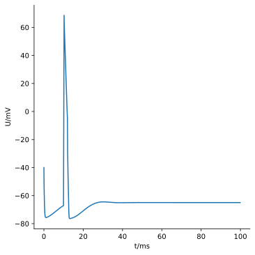

.. _gs_single_cell:

A single cell model
================================

Building and testing detailed models of individual cells, then optimizing their
parameters is usually the first step in building models with multi-compartment cells.
Arbor supports a *single cell model* workflow for this purpose, which is a good way to
introduce Arbor's cell modelling concepts and approach.

This guide will walk through a series of single cell models of increasing complexity.
Links are provided to separate documentation that covers relevant topics in more detail.

In an interactive Python interpreter, you can use ``help()`` on any class or function to
obtain some documentation.

.. _single_soma:

Single compartment cell with HH dynamics
----------------------------------------------------

The most trivial representation of a cell in Arbor is to model the entire cell as a
cylinder. The following example shows the steps required to construct a model of a
cylindrical cell with radius 3 μm, Hodgkin–Huxley dynamics and a current clamp stimulus,
then run the model for 30 ms.

The first step is to construct the cell. In Arbor, the abstract representation used to
define a cell with branching "cable" morphology is a ``cable_cell``, which holds a
description of the cell's morphology, named regions and locations on the morphology, and
descriptions of ion channels, synapses, spike detectors and electrical properties.

Our "single-compartment HH cell" has a simple morphology and dynamics, so the steps to
create the ``cable_cell`` that represents it are as follows:

.. code-block:: python

    import arbor

    # (1) Create a morphology with a single (cylindrical) segment of length=diameter=6 μm
    tree = arbor.segment_tree()
    tree.append(arbor.mnpos, arbor.mpoint(-3, 0, 0, 3), arbor.mpoint(3, 0, 0, 3), tag=1)

    # (2) Define the soma and its center
    labels = arbor.label_dict({'soma':   '(tag 1)',
                               'center': '(location 0 0.5)'})

    # (3) Create cell and set properties
    cell = arbor.cable_cell(tree, labels)
    cell.set_properties(Vm=-40)
    cell.paint('"soma"', 'hh')
    cell.place('"center"', arbor.iclamp( 10, 2, 0.8))
    cell.place('"center"', arbor.spike_detector(-10))

Let's unpack that.

Step **(1)** above shows how the cell is represented using a :class:`arbor.segment_tree`
to which a single segment is added. Arbor's cell morphologies are constructed from a
segment tree which is a list of segments, which are tapered cones with a *tag*.
:meth:`arbor.segment_tree.append` takes 4 arguments, starting with
the parent segment. The first segment added has no parent however, which is made clear by
using :class:`arbor.mnpos`. Then two :class:`arbor.mpoint` s are supplied, the proximal
and distal endpoints of the segment. Finally, an integer value can be supplied to tag the
segment for future reference.

In step **(2)** a dictionary of labels is created using :class:`arbor.label_dict<arbor.label_dict>`.
Cell builders need to refer to *regions* and *locations* on a cell
morphology. Arbor uses a domains specific language (DSL) to describe regions and
locations, which are given labels. We add two labels:

* ``soma`` defines a *region* with ``(tag  2)``. Note that this corresponds to the
  ``tag`` parameter that was used to define the single segment in step (1).
* ``center`` defines a *location* at ``(location 0 0.5)``, which is the mid point ``0.5``
  of branch ``0``, which corresponds to the center of the soma on the morphology defined in Step (1).

In step **(3)** a :class:`arbor.cable_cell` is constructed by combining the segment tree
with the named regions and locations.

* "Cell-wide" properties are set through :meth:`arbor.cable_cell.set_properties`. Here,
  the initial membrane potential everywhere on the cell is set to -40 mV.
* Properties can also be set to a region of the cell, which Arbor calls 'painting'. This
  is meant to convey placement is not precise: we wouldn't want to manually place ion
  channels all over the surface of the cell. :meth:`arbor.cable_cell.paint` lets us
  instruct Arbor to use HH dynamics on the region we've labelled soma and sort the details
  out for us.
* Other properties we do want to :meth:`arbor.cable_cell.place<arbor.cable_cell.place>`
  in a precise :class:`arbor.location<arbor.location>`. We place two things:
  an :class:`arbor.iclamp<arbor.iclamp>` with a duration of 2 ms and a current of
  0.8 nA, starting at 10 ms. Then, add an :class:`arbor.spike_detector<arbor.spike_detector>`
  with a threshold of -10 mV to the location we've labelled 'center'.

Single cell network
----------------------------------------------------

Great, we have defined our cell! Now, let's move to the network. Arbor can simulate
networks with multiple individual cells, connected together in a network. Single cell
models do not require the full *recipe* interface used to describing such network models,
with many unique cells, network and gap junctions. Arbor provides a
:class:`arbor.single_cell_model<arbor.single_cell_model>` helper that wraps a cell description,
and provides an interface for recording potentials and running the simulation.

.. code-block:: python

    # (4) Make single cell model.
    m = arbor.single_cell_model(cell)

    # (5) Attach voltage probe sampling at 10 kHz (every 0.1 ms).
    m.probe('voltage', '"center"', frequency=10000)

    # (6) Run simulation for 30 ms of simulated activity.
    m.run(tfinal=30)

Step **(4)** instantiates the :class:`arbor.single_cell_model<arbor.single_cell_model>`
with our single-compartment cell.

In step **(5)** a :meth:`arbor.single_cell_model.probe()<arbor.single_cell_model.probe>`
is used to record variables from the model. Three pieces of information are
provided: the type of quantity we want probed (voltage), the location where we want to
probe ('center'), and the frequency at which we want to sample (10kHz).

Finally, step **(6)** starts the actual simulation for a duration of 30 ms.

Results
----------------------------------------------------

Our cell and network are defined; we have ran the simulation. However, we have not looked
at any results! We have added two things that should have recorded something, a
spike_detector and a voltage probe. Let's see what they have produced!

.. code-block:: python

    # (7) Print spike times, if any.
    if len(m.spikes)>0:
        print('{} spikes:'.format(len(m.spikes)))
        for s in m.spikes:
            print('{:3.3f}'.format(s))
    else:
        print('no spikes')

    # (8) Plot the recorded voltages over time.
    import pandas, seaborn # You may have to pip install these.
    seaborn.set_theme() # Apply some styling to the plot
    df = pandas.DataFrame({'t/ms': m.traces[0].time, 'U/mV': m.traces[0].value})
    seaborn.relplot(data=df, kind="line", x="t/ms", y="U/mV").savefig('single_cell_model_result.svg')

In step **(7)** we access :meth:`arbor.single_cell_model.spikes<arbor.single_cell_model.spikes>`
to access the spike time. A single spike at a little over 10
ms should be printed, which matches the stimulus we have provided in step (3).

The other measurement we have is that of the potential, which we plot in step **(8)**.
Arbor stores sampled quantities under
:meth:`arbor.single_cell_model.traces<arbor.single_cell_model.traces>`.
You should be seeing something like this:

    Plot of the potential over time for the voltage probe added in step (5).

You can find the source code for this example in full at ``python/examples/single_cell_model.py``.

.. Todo::
    Add equivalent but more comprehensive recipe implementation in parallel, such that the reader learns how single_cell_model works.
