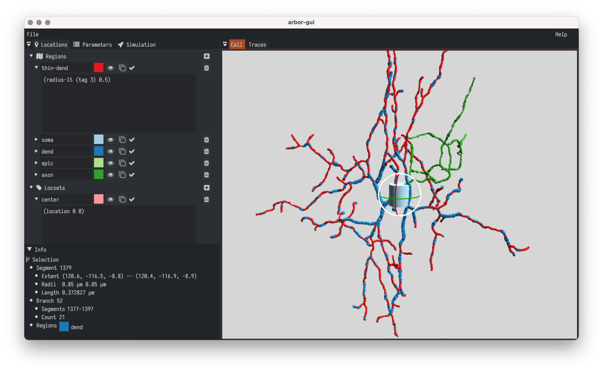

.. _in_gui:

Arbor GUI
=========

    Arbor GUI

Arbor GUI is a comprehensive tool for building single cell
models using Arbor. It strives to be self-contained, fast, and easy to
use.

- Design morphologically detailled cells for simulation in Arbor.
- Load morphologies from SWC ``.swc``, NeuroML ``.nml``, NeuroLucida ``.asc``.
- Define and highlight Arbor regions and locsets.
- Paint ion dynamics and bio-physical properties onto morphologies.
- Place spike detectors and probes.
- Export cable cells to Arbor's internal format (ACC) for direct
  simulation.
- Import cable cells in ACC format

Get Arbor GUI
-------------

Precompiled and self-contained versions for Macos and Linux are available
at the same locations at our `GitHub Releases page <https://github.com/arbor-sim/gui/releases/>`_.
These versions are self-contained and ready for launch.

To get a feel for the workflow with Arbor-GUI, you can
take a look at :ref:`the tutorial <tutorialgui>`.

The source code is available `at GitHub <https://github.com/arbor-sim/gui>`_.
We welcome bug reports and feature requests, please use the issue
tracker on GitHub for making them. Currently, building network simulation
is out of scope for this project.
