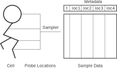
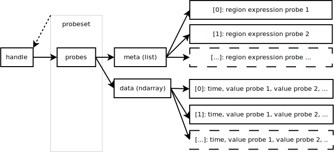

.. _pycablecell-probesample:

Cable cell probing and sampling
===============================

.. module:: arbor
   :noindex:

    A schematic view of how :term:`handles <handle>` let you access sampled data measured at a :term:`probeset`.
    A probeset is a probe placed on a locset (which may describe more than one point). 
    When setting a probe on a locset a :term:`sampler` is created.
    When this sampler is set to sampling (at a certain schedule), a handle is returned.
    This figure demonstrates how sampling data can be accessed through the handle associated to the probeset.
    See below for a possible result for ``data``.

.. code-block:: python
   
   print(data) # The probe data printed, as found in single_cell_recipe.py
   [[ 0.00000000e+00 -4.00000000e+01]
    [ 1.00000000e-01 -5.40211646e+01]
    [ 2.00000000e-01 -6.19670534e+01]
    ...
    [ 2.99000000e+01 -6.44564354e+01]]

Sample data recorded by the Arbor simulation object is returned in the form 
of a NumPy array, with the first column holding sample times, and subsequent 
columns holding the corresponding scalar- or vector-valued sample.

Probesets are defined over a location expression and will describe zero,
one, or more probes, one per site. They are evaluated in the context of
the cell on which the probe is attached.

:term:`Vector probes <vector probe>` are a kind of probes that samples over a region, rather than a :term:`locset`.
This means that they may output more than a single data point per timestamp. The layout of the outputs as returned
by :func:`~arbor.simulation.samples` is slightly different, but contains the same sort of information as regular
:term:`probesets <probeset>`.

    The structure of the data returned is slightly different when a :term:`vector probe` is sampled.
    The same kind of information is included however. Instead of returning a list per :term:`probe` in a :term:`probeset`,
    the data and metadata now have an extra dimension to cover for the multitude of subregions.

Each of the functions described below generates an opaque :class:`probe`
object for use in the recipe :py:func:`recipe.probes` method.

More information on probes, probe metadata, and sampling can be found
in the documentation for the class :class:`simulation`.

.. note::

   Cable cell probesets are defined analogously to their counterparts in
   the C++ API (see :ref:`cablecell-probes` for details). Some details 
   like `probe_tag` are not exposed in Python, as having Python probe callbacks
   has proven to be too slow.

Example
-------

.. code-block:: python
   
   import arbor

   tree = arbor.segment_tree()
   p = tree.append(arbor.mnpos, arbor.mpoint(-3, 0, 0, 3), arbor.mpoint(3, 0, 0, 3), tag=1)
   tree.append(p, arbor.mpoint(3, 0, 0, 3), arbor.mpoint(-3, 0, 0, 3), tag=2)
   tree.append(p, arbor.mpoint(3, 0, 0, 3), arbor.mpoint(-3, 0, 0, 3), tag=2)

   decor = (
      arbor.decor()
      .set_property(Vm=-40)
      .paint('"soma"', arbor.density("hh"))
      .place('"midpoint"', arbor.iclamp(10, 2, 0.8), "iclamp"))

   cell = arbor.cable_cell(tree, decor)

   class single_recipe(arbor.recipe):
      def __init__(self):
         arbor.recipe.__init__(self)

      def num_cells(self):
         return 1

      def cell_kind(self, gid):
         return arbor.cell_kind.cable

      def cell_description(self, gid):
         return cell

      def probes(self, gid):
         return [arbor.cable_probe_membrane_voltage('(location 0 0.5)'),
                  arbor.cable_probe_membrane_voltage_cell(),
                  arbor.cable_probe_membrane_voltage('(join (location 0 0) (location 0 1))'),
                  ]

      # (4.6) Override the global_properties method
      def global_properties(self, kind):
         return arbor.neuron_cable_properties()

   recipe = single_recipe()
   sim = arbor.simulation(recipe)
   handles = [sim.sample((0, n), arbor.regular_schedule(0.1))
            for n in range(3) ]
   sim.run(tfinal=1)

   for hd in handles:
      print("Handle", hd)
      for d, m in sim.samples(hd):
         print(" * Meta:", m)
         print(" * Payload:", d.shape)

This script, has a single (scalar) probe, a single vector probe, and a probeset involving two scalar probes.
The script is complete and can be run with Arbor installed, and will output:

.. code-block::

   Handle 0
   * Meta: (location 0 0.5)
   * Payload: (10, 2)
   Handle 1
   * Meta: [(cable 0 0 1), (cable 0 1 1), (cable 1 0 0), (cable 2 0 0), (cable 1 0 1), (cable 2 0 1)]
   * Payload: (10, 7)
   Handle 2
   * Meta: (location 0 0)
   * Payload: (10, 2)
   * Meta: (location 0 1)
   * Payload: (10, 2)

API
---

.. class:: probe

    An opaque object that is the Python representation of :cpp:class:`probe_info`.
    
    See below for ways to create probes.

Membrane voltage
   .. py:function:: cable_probe_membrane_voltage(where)

   Cell membrane potential (mV) at the sites specified by the location
   expression string ``where``. This value is spatially interpolated.

   Metadata: the explicit :class:`location` of the sample site.

   .. py:function:: cable_probe_membrane_voltage_cell()

   Cell membrane potential (mV) associated with each cable in each CV of
   the cell discretization.

   Metadata: the list of corresponding :class:`cable` objects.

   Kind: :term:`vector probe`.

Axial current
   .. py:function:: cable_probe_axial_current(where)

   Estimation of intracellular current (nA) in the distal direction at the
   sites specified by the location expression string ``where``.

   Metadata: the explicit :class:`location` of the sample site.

Ionic current
   .. py:function:: cable_probe_ion_current_density(where, ion)

   Transmembrane current density (A/m²) associated with the given ``ion`` at
   sites specified by the location expression string ``where``.

   Metadata: the explicit :class:`location` of the sample site.

   .. py:function:: cable_probe_ion_current_cell(ion)

   Transmembrane current (nA) associated with the given ``ion`` across each
   cable in each CV of the cell discretization.

   Metadata: the list of corresponding :class:`cable` objects.

   Kind: :term:`vector probe`.

Total ionic current
   .. py:function:: cable_probe_total_ion_current_density(where)

   Transmembrane current density (A/m²) _excluding_ capacitive currents at the
   sites specified by the location expression string ``where``.

   Metadata: the explicit :class:`location` of the sample site.

   .. py:function:: cable_probe_total_ion_current_cell()

   Transmembrane current (nA) _excluding_ capacitive currents across each
   cable in each CV of the cell discretization. Stimulus currents are not included.

   Metadata: the list of corresponding :class:`cable` objects.

   Kind: :term:`vector probe`.

Total transmembrane current
   .. py:function:: cable_probe_total_current_cell()

   Transmembrane current (nA) *including* capacitive currents across each
   cable in each CV of the cell discretization. Stimulus currents are not included.

   Metadata: the list of corresponding :class:`cable` objects.

   Kind: :term:`vector probe`.

Total stimulus current
   .. py:function:: cable_probe_stimulus_current_cell()

   Total stimulus current (nA) across each cable in each CV of the cell discretization.

   Metadata: the list of corresponding :class:`cable` objects.

   Kind: :term:`vector probe`.

Density mechanism state variable
   .. py:function:: cable_probe_density_state(where, mechanism, state)

   The value of the state variable ``state`` in the density mechanism ``mechanism``
   at the sites specified by the location expression ``where``.

   Metadata: the explicit :class:`location` of the sample site.

   .. py:function:: cable_probe_density_state_cell(mechanism, state)

   The value of the state variable ``state`` in the density mechanism ``mechanism``
   on each cable in each CV of the cell discretization.

   Metadata: the list of corresponding :class:`cable` objects.

   Kind: :term:`vector probe`.

Point process state variable
   .. py:function:: cable_probe_point_state(target, mechanism, state)

   The value of the state variable ``state`` in the point process ``mechanism``
   associated with the target index ``target`` on the cell. If the given mechanism
   is not associated with the target index, no probe will be generated.

   Metadata: an object of type :class:`cable_point_probe_info`, comprising three fields:

   * ``target``: target index on the cell;

   * ``multiplicity``: number of targets sharing the same state in the discretization;

   * ``location``: :class:`location` object corresponding to the target site.

   .. py:function:: cable_probe_point_state_cell(mechanism, state)

   The value of the state variable ``state`` in the point process ``mechanism``
   at each of the targets where that mechanism is defined.

   Metadata: a list of :class:`cable_point_probe_info` values, one for each matching
   target.

   Kind: :term:`vector probe`.

Ionic internal concentration
   .. py:function:: cable_probe_ion_int_concentration(where, ion)

   Ionic internal concentration (mmol/L) of the given ``ion`` at the
   sites specified by the location expression string ``where``.

   Metadata: the explicit :class:`location` of the sample site.

   .. py:function:: cable_probe_ion_int_concentration_cell(ion)

   Ionic internal concentration (mmol/L) of the given ``ion`` in each able in each
   CV of the cell discretization.

   Metadata: the list of corresponding :class:`cable` objects.

   Kind: :term:`vector probe`.

Ionic external concentration
   .. py:function:: cable_probe_ion_ext_concentration(where, ion)

   Ionic external concentration (mmol/L) of the given ``ion`` at the
   sites specified by the location expression string ``where``.

   Metadata: the explicit :class:`location` of the sample site.

   .. py:function:: cable_probe_ion_ext_concentration_cell(ion)

   Ionic external concentration (mmol/L) of the given ``ion`` in each able in each
   CV of the cell discretization.

   Metadata: the list of corresponding :class:`cable` objects.

   Kind: :term:`vector probe`.

LIF Cell probing
================

Membrane voltage
   .. py:function:: lif_probe_voltage()

   Current cell membrane potential (mV).

   Metadata: none
