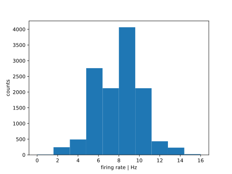
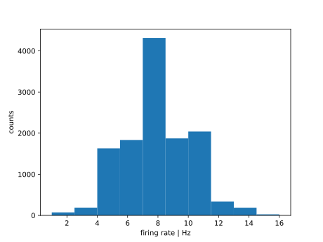

.. _tutorialbrunel:

Brunel network
==============

In this tutorial, we will build a classic Brunel network using LIF cells in Arbor, and you can compare it with the simulation using LIF cells in the NEST simulator.

.. admonition:: Concepts covered in this example
   :class: note
    
 1. Build LIF cells by loading certain neuron parameters from the parameter file.
 2. Connect neurons in a fixed in-degree manner based on a connection probability.
 3. Add Poissonian input to drive the network activity.
 4. Record spikes and plot raster plot and peristimulus time histogram (PSTH).

Start a recipe and initiate the parameters
------------------------------------------

Here, we will follow the protocol for building the recipe, which has been discussed before in :ref:`Ring Network
<tutorialnetworkring>`.

.. literalinclude:: ../../python/example/brunel/arbor_brunel.py
   :language: python
   :dedent:
   :lines: 4-62

We can find all the parameters listed in a separate parameter file:

.. literalinclude:: ../../python/example/brunel/parameters.py
   :language: python
   :dedent:
   :lines: 1-53

We define the network size with ``num_cells`` and cell type with ``cell_kind``. Then load all the neuron parameters to the LIF cells with ``cell_description`` function.

.. literalinclude:: ../../python/example/brunel/arbor_brunel.py
   :language: python
   :dedent:
   :lines: 64-81

The Brunel network is randomly sparsely connected with a fixed in-degree regulated by a connection probability (:math:`\epsilon`). We, therefore, define a function to enable random connectivity. This funciton draws random connections from the pre-selected pool of source neruons defined by the `gid` defined within `start` and `end`. The total number of random connections are regulated by the fix-indegree value, which is `m` here in the function and `CE` and `CI` in the parameters file.

.. literalinclude:: ../../python/example/brunel/arbor_brunel.py
   :language: python
   :dedent:
   :lines: 83-112

To enable the network activity, we apply Poissonian input via ``event_generators`` to to each neuron in the network. It aims to achieve a similar effect as the ``Poisson_generator`` in the NEST simulator.

.. literalinclude:: ../../python/example/brunel/arbor_brunel.py
   :language: python
   :dedent:
   :lines: 114-125

In the end, we build the network, run the simulation, and record the spikes.

.. literalinclude:: ../../python/example/brunel/arbor_brunel.py
   :language: python
   :dedent:
   :lines: 128-172

One can also use the code below to visualize the raster plot of the entire nework and a few selected cells, and the peristimulus time histogram (PSTH) of the entire network. The parameters used here are supposed to achieve asynchronous irregular dynamics.

.. literalinclude:: ../../python/example/brunel/analysis.py
   :language: python
   :dedent:
   :lines: 1-56

.. figure:: ../images/brunel_arbor_dynamics.svg
    :width: 600
    :align: center

    Raster plot and PSTH of the Brunel network simulated in Arbor.

    Firing rate distribution of all neurons in the Brunel network simulated in Arbor.
    

The full code
-------------
You can find the same network architecture simulated in the NEST simulator in the same repo ``python/examples/brunel/nest_brunel.py``. The average firing rate of neurons and network dynamics look similar in both cases.

.. figure:: ../images/brunel_nest_dynamics.svg
    :width: 600
    :align: center

    Raster plot and PSTH of the Brunel network simulated in NEST.

    Firing rate distribution of all neurons in the Brunel network simulated in NEST.
    

References
----------
.. [1] Brunel, Journal of Computational Neuroscience 8: 183-208 (2000); `<https://link.springer.com/article/10.1023/A:1008925309027>`_.
