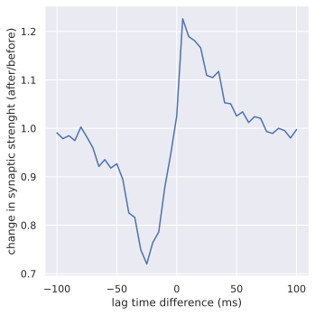

.. _tutorial_calcium_stpd_curve:

Spike Timing-dependent Plasticity Curve
=======================================

This tutorial uses a single cell and reproduces `this Brian2 example
<https://brian2.readthedocs.io/en/latest/examples/frompapers.Graupner_Brunel_2012.html>`_.  We aim
to reproduce a spike timing-dependent plastivity curve which arises from stochastic calcium-based
synapse dynamics described in Graupner and Brunel [1]_.

The synapse is modeled as synaptic efficacy variable, :math:`\rho`, which is a function of the
calcium concentration, :math:`c(t)`. There are two stable states at :math:`\rho=0` (DOWN) and
:math:`\rho=1` (UP), while :math:`\rho=\rho^\ast=0.5` represents a third unstable state between the
two stable states.  The calcium concentration dynamics are represented by a simplified model which
uses a linear sum of individual calcium transients elicited by trains of pre- and postsynaptic
action potentials:

.. math::

   \begin{align*}
   c^\prime (t) &= - \frac{1}{\tau_{Ca}}c 
                   + C_{pre} \sum_i \delta(t-t_i-D)
                   + C_{post} \sum_j \delta(t-t_j), \\
   \rho^\prime(t) &= - \frac{1}{\tau}\left [
                     \rho (1 - \rho) (\rho^\ast - \rho)
                     -\gamma_p (1-\rho) H\left(c - \theta_p \right)
                     + \gamma_d \rho H\left(c - \theta_d \right) \right ]
                     + N, \\
   N &= \frac{\sigma}{\sqrt{\tau}} \sqrt{H\left( c - \theta_p \right)
        + H\left( c - \theta_d \right)} W.
   \end{align*}

Here, the sums over :math:`i` and :math:`j` represent the contributions from all pre and
postsynaptic spikes, respectively, with :math:`C_{pre}` and :math:`C_{pre}` denoting the jumps in
concentration after a spike. The jump after the presynaptic spike is delayed by :math:`D`.  The
calcium decay time is assumed to be much faster than the synaptic time scale,
:math:`\tau_{Ca} \ll \tau`. The subscripts :math:`p` and :math:`d` represent potentiation (increase
in synaptic efficacy) and depression (decrease in synaptic efficacy), respectively, with
:math:`\gamma` and :math:`\theta` being the corresponding rates and thresholds. :math:`H(x)` is the
right-continuous heaviside step function (:math:`H(0)=1`).

This mechanism is stochastic, :math:`W` represents a white noise process, and therefore our
simulation needs to

- use a stochastic synapse mechanism,
- accumulate statistics over a large enough ensemble of initial states.

Implementation of a Stochastic Mechanism
----------------------------------------

Implementing a stochastic mechanism which is given by a stochastic differential equation (SDE) as
above is straightforward to implement in :ref:`Arbor's NMODL dialect <format-sde>`. Let's examine
the mechanism code in the `Arbor repository
<https://github.com/arbor-sim/arbor/mechanisms/stochastic/calcium_based_synapse.mod>`_.

The main difference compared to a deterministic (ODE) description is the additional `WHITE_NOISE`
block,

.. code:: none

   WHITE_NOISE {
       W
   }

which declares the white noise process :math:`W`, and the specification of the `stochastic` solver
method,

.. code:: none

   BREAKPOINT {
       SOLVE state METHOD stochastic
   }

This is sufficient to inform Arbor about the stochasticity of the mechanism. For more information
about Arbor's strategy to solve SDEs, please consult :ref:`this overview <mechanisms-sde>`, while
details about the numerical solver can be found in the :ref:`developers guide <sde>`.

The Model
---------

In this tutorial, the neuron model itself is simple with only
passive (leaky) membrane dynamics, and it receives regular synaptic current
input in one arbitrary chosen control volume (CV) to trigger regular spikes.

First we import some required modules:

.. literalinclude:: ../../python/example/calcium_stdp.py
   :language: python
   :lines: 13-18

Next we set the simulation parameters in order to reproduce the plasticity curve:

.. literalinclude:: ../../python/example/calcium_stdp.py
   :language: python
   :lines: 20-41

The time lag resolution, together with the maximum time lag, determine the number of cases we want
to simulate. For each such case, however, we need to run many simulations in order to get a
statistically meaningful result. The number of simulations per case is given by the ensemble size
and the initial conditions. In our case, we have two inital states, :math:`\rho(0)=0` and
:math:`\rho(0)=1`, and for each initial state we want to run :math:`100` simulations. We note, that
the stochastic synapse mechanism does not alter the state of the cell, but couples one-way only by
reacting to spikes. Therefore, we are allowed to simply place :math:`100` synapses per initial state
onto the cell without worrying about interference. Moreover, this has the benefit of exposing
parallelism that Arbor can take advantage of.

Thus, we create a simple cell with a midpoint at which we place our mechanisms:

.. literalinclude:: ../../python/example/calcium_stdp.py
   :language: python
   :lines: 44-67

Since our stochastic mechanism `calcium_based_synapse` is not within Arbor's default set of
mechanism, we need to extend the mechanism catalogue within the cable cell properties:

.. literalinclude:: ../../python/example/calcium_stdp.py
   :language: python
   :lines: 70-74

Our cell and cell properties can then later be used to create a simple recipe:

.. literalinclude:: ../../python/example/calcium_stdp.py
   :language: python
   :lines: 77-103

Note, that the recipe takes a cell, cell properties and a list of event generators as constructor
arguments and returns them with its corresponding methods. Furthermore, the recipe also returns a
list of probes which contains only one item: A query for our mechanism's state variable
:math:`\rho`. Since we placed a number of these mechanisms on our cell, we will receive a vector of
values when probing.

Next we set up the simulation logic:

.. literalinclude:: ../../python/example/calcium_stdp.py
   :language: python
   :lines: 106-134

The pre- and postsynaptic events are generated at explicit schedules, where the presynaptic event
is shifted in time by :math:`D -\text{time lag}` with respect to the presynaptic event, which in
turn is generated regularly with the frequency :math:`f`. The postsynaptic events are driven by the
deterministic synapse with weight `1.0`, while the presynaptic events are generated at the
stochastic calcium synapses. The postsynaptic weight can be set arbitrarily as long as it is large
enough to trigger the spikes.

Thus, we have all ingredients to create the recipe

.. literalinclude:: ../../python/example/calcium_stdp.py
   :language: python
   :lines: 136-137

Now, we need to initialize the simulation, register a probe and run the simulation:

.. literalinclude:: ../../python/example/calcium_stdp.py
   :language: python
   :lines: 139-154

Since we are interested in the long-term average value, we only query the probe at the end of the
simulation.

After the simulation is finished, we calculate the change in synaptic strength by evaluating the
transition probabilies from initial DOWN state to final UP state and vice versa.

.. literalinclude:: ../../python/example/calcium_stdp.py
   :language: python
   :lines: 156-174

Since we need to run our simulation for each time lag case anew, we spawn a bunch of threads to
carry out the work in parallel:

.. literalinclude:: ../../python/example/calcium_stdp.py
   :language: python
   :lines: 177-178

The collected results can then be plotted:

    Comparison of this simulation with reference simulation [1]_; for a simulation duration
    of 60 spikes at 1 Hertz, ensemble size of 2000 per initial state and time step dt=0.01 ms.
    The shaded region indicates the 95\% confidence interval.

The full code
-------------
You can find the full code of the example at ``python/examples/calcium_stdp.py``.

References
----------
.. [1] Graupner and Brunel, PNAS 109 (10): 3991-3996 (2012); `<https://doi.org/10.1073/pnas.1109359109>`_, `<https://www.pnas.org/doi/10.1073/pnas.1220044110>`_.
