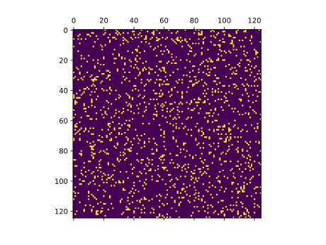

.. _tutorial_connectivity:

Declarative Connectivity in Arbor
=================================

.. admonition:: Concepts and Requirements

    We will assume that you have read the basic recipe and network tutorials.

    In addition to Arbor and its requirements ``matplotlib`` and ``networkx``
    need to be installed.

In this tutorial, we are going to demonstrate how to leverage Arbor's
declarative connection description facilities to generate a few common network
types. We will gradually build up complexity and generally show the full recipe
first before discussing some of the relevant parts. High-level connectivity
descriptions can be more intuitive for some types of networks as well as more
performant in Python simulations, as the construction is handled entirely in C++.

Prelude: Unconnected Cells
--------------------------

Before we start building actual networks, we will set up the trivial network,
which has no connections at all. This will be written as a recipe class, as
discussed in other tutorials, and later examples will derive from this class to
build upon. If you want, you can skip this part and come back as needed.

Our cells comprise a simple leaky integrate and fire model, not a cable cell, as
we want to emphasize building networks. We begin by defining the global settings:

.. literalinclude:: ../../python/example/connectivity/unconnected.py
  :language: python
  :lines: 7-13

- ``N`` is the cell count of the simulation.
- ``T`` is the total runtime of the simulation in ``ms``.
- ``dt`` is the numerical timestep on which cells evolve.

These parameters are used here:

.. literalinclude:: ../../python/example/connectivity/unconnected.py
  :language: python
  :lines: 50-

where we run the simulation. Before we discuss the relevant details, the recipe
reads in full

.. literalinclude:: ../../python/example/connectivity/unconnected.py
  :language: python
  :lines: 16-47

In the recipe, we set a prototypical LIF cell:

.. literalinclude:: ../../python/example/connectivity/unconnected.py
  :language: python
  :lines: 21

and deliver it for all ``gid``:

.. literalinclude:: ../../python/example/connectivity/unconnected.py
  :language: python
  :lines: 43-44

With large and complicated cells this can sometimes help with performance, here,
it's just a convenient way to structure our recipe. Also, the *first cell* has
an event generator attached, a Poisson point process seeded with the
cell's ``gid``.

.. literalinclude:: ../../python/example/connectivity/unconnected.py
  :language: python
  :lines: 31-41

All other parameters are set in the constructor:

.. literalinclude:: ../../python/example/connectivity/unconnected.py
  :language: python
  :lines: 17-26

We also proceed to add spike recording and generate raster plots using a helper
function ``plot_spikes`` from ``util.py``, which results in

As only the first cell receives spiking inputs, only it will show up on the plot.

Ring Network
------------

Starting from an unconnected set of cells, we can now start building a simple
network. A ring structure is defined by connecting each cell to its predecessor,
i.e. the cell with ``gid = i`` is connected to the cell with ``gid = i - 1`` and
the cell ``gid = 0`` is connected to the last cell ``gid = N - 1``.

We construct such a network by defining a new recpi ``ring`` deriving from the
unconnected network

.. literalinclude:: ../../python/example/connectivity/ring.py
  :language: python

The idiomatic way of extending classes with new functionality is to use
inheritance. Importantly, the burden of initializing the base class falls on the
derived class:

.. literalinclude:: ../../python/example/connectivity/ring.py
  :language: python
  :lines: 18-20

Next, we add a new method that is responsible for the network. Note that this
--- in contrast to most other methods on recipe --- does not have an argument of
``gid``, since it is definining the *global* network.

.. literalinclude:: ../../python/example/connectivity/ring.py
  :language: python
  :lines: 22-31

Similar to the construction of a ``decor`` or ``cv_policy``, a light-weight
language inspired by LISP or Scheme is used here. For this tutorial, we use
Python format strings to compose expressions. Networks comprise a structure and
parameters --- ``weight`` and ``delay``, which can be scalars as shown, or more
elaborate expressions, such a drawing from a random distribution.

The structure is defined in terms of combinators reminiscent of relational
algebra queries operating on abstract sets of source and target identifiers.

- ``source-cell`` and ``target-cell`` construct a set of eligble sources and targets from a single ``gid``.
- ``gid-range`` defines a contiguous range of gids ``[start, end)``
- ``intersect`` constructs the connections between the ``source`` and ``target`` arguments.
- ``chain`` constructs the set of connections between adjacent neighbours.
- ``join`` takes two sub-structures ``A`` and ``B`` and returns their union.

Upon close inspection, these combinators directly spell out the prose
description of the ring network given above: Connect adjacent cells and close
the ring by connecting the beginning and end! Running the network and plotting
the spikes we find cells deeper into the ring spiking now

The network structure is rendered via ``networkx``

Excercise: All-to-all Network
-----------------------------

Using the ``unconnected`` recipe and the
`network documentation <https://docs.arbor-sim.org/en/stable/concepts/interconnectivity.html#network-selection-expressions>`_
define a fully connected network, i.e. where each cell is connected to every other cell except itself.

.. hint::

   1. ``source-cell`` and ``target-cell`` can take a range of ids
   2. Use and intersection with ``inter-cell`` to remove self connections

Our solution produces the following output

The network should look like this

For reference, we reproduce it here:

.. literalinclude:: ../../python/example/connectivity/all-to-all.py
  :language: python

Brunel Network
--------------

The Brunel network, or in other words, a inhibition-dominated randomly connected
recurrent network, is a common network structure used in computational
neuroscience proposed by Nicolas Brunel in 2000. It contains sparsely connected
inhibitory and excitatory neurons where a critical balance between inhibition
and excitation inputs to each neuron is maintained to ensure a brain-realistic
network-wide dynamics. It entails a few typical dynamics of cortical circuits.

Practically, we can describe this network by two populations, called the
excitatory and inhibitory populations, such that

1. Each cell is connected to each other with some probablity :math:`0 < p < 1`
   - There no self-connections
2. If the pre-synaptic cell is in the excitatory population, the weight is :math:`w_{exc} > 0`
3. If the pre-synaptic cell is in the inhitatory population, the weight is :math:`w_{inh} < 0`
   - :math:`|w_{inh}| < |w_{exc}|`

The Brunel network simulation can be implemented like this

.. literalinclude:: ../../python/example/connectivity/brunel.py
  :language: python
  :lines: 18-32

again using the base class ``unconnected`` to define everything except the
network. We implement these by writing down the rules above in the recipe

.. literalinclude:: ../../python/example/connectivity/brunel.py
  :language: python
  :lines: 34-42

The ``rand`` structure encodes the random connectivity and removes any potential
self-connections by ``intersect`` with ``inter-cell``, as before. Next, we
define the weight according the population of the pre-synaptic neuron. The
population is defined by the ``gid`` of the neuron; the first 80% of cells is
considered excitatory and the remainder inhibitory. The predicate ``inh``
reifies this description. The weight function ``weight`` then dispatches to one
of two values based on the predicate.

Rendering the structure becomes slow and frankly unusable, but showing the
adjacency matrix might be helpful

Note that rendering can be disabled, if things get too slow.

Final Thoughts
--------------

Using a few examples we have shown how Arbor's high-level network description
method can be leveraged to generate common structures. The key insight is to
build complex layouts from atomic blocks by using set operators like ``join``,
``difference``, and ``intersect``. There are more to explore in the
documentation, be especially aware of stochastic distributions. We have also
seen how to produce weights and by extension delays using the same, declarative
approach. This functionality is quite young and if any useful additions come to
mind, do not hesitate to request or implement them!
