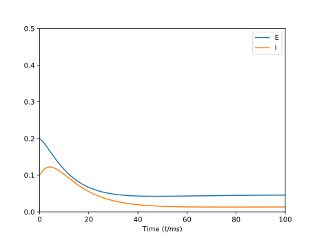
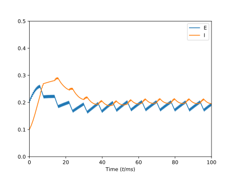

.. _tutorial_cosimulation:

How to use MPI to generate coupled simulations at different scales
==================================================================

In this tutorial we are going to discuss how to use Arbor and MPI to drive
simulations at different scales or levels of abstraction. This _requires_ an
MPI-enabled build of Arbor. In general, throughout this tutorial, we are
assuming you are comfortable with the basics of Arbor (cells, recipes, and
networks), Python package management, and MPI, as wells as installing software
on your system.

Setup
-----

Since we need an MPI-capable build, we need to install from source, which is
simple, but might require some guidance. We demonstrate it using the ``uv``
package manager. Before starting, you should install MPI using your system's
method, e.g. using ``brew install`` (MacOS) or ``apt install`` (Ubuntu), CMake,
and a C++ compiler. If these are missing, you will encounter errors during the
build step. Begin by setting up the environment

.. code-block::

    uv venv
    source .venv/bin/activate
    uv pip install numpy mpi4py polars scikit-build-core matplotlib seaborn scipy pybind11-stubgen

then install Arbor

.. code-block::
              
    CMAKE_ARGS="-DPYTHON_EXECUTABLE=`which python3` -DARB_VECTORIZE=ON -DARB_ARCH=native -DARB_WITH_MPI=ON" uv pip install --no-cache-dir --no-binary arbor --no-build-isolation arbor

This will install a vectorised (making better use of modern CPUs) and
MPI-enabled version of Arbor. You can test it using a file 

.. literalinclude:: ../../python/example/cosim/step-01.py
  :language: python

which should print

.. code-block::

   {'mpi': True, 'mpi4py': True, 'gpu': None, 'vectorize': True, ... more fields elided}

Creating an Arbor model
-----------------------

For co-simulation, we need a network model in Arbor and some disjoint model that
receives and produces spikes in exchange. We will, for sake of the
demonstration, use a simple ring of leaky-integrate-and-fire cells, but the
concepts translate to cable cells and more complex networks straightforwardly.

We import the usual libraries

.. literalinclude:: ../../python/example/cosim/ring.py
    :language: python
    :lines: 1-2

and create a ``recipe`` with a configurable number of ``lif`` cells

.. literalinclude:: ../../python/example/cosim/ring.py
    :language: python
    :lines: 5-18

that connect in a ring

.. literalinclude:: ../../python/example/cosim/ring.py
    :language: python
    :lines: 20-22

At time ``0.1 ms`` we inject a single spike into the first cell

.. literalinclude:: ../../python/example/cosim/ring.py
    :language: python
    :lines: 24-27

that should propagate indefinitely. To confirm, we set up the simulation
and run it for ``10ms``, printing out spikes at the end:

.. literalinclude:: ../../python/example/cosim/ring.py
    :language: python
    :lines: 30-36

and receive

.. code-block::

    0.1ms gid=  0
    0.6ms gid=  1
    1.1ms gid=  2
    1.6ms gid=  3
    2.1ms gid=  0
    2.6ms gid=  1
    3.1ms gid=  2
    3.6ms gid=  3
    4.1ms gid=  0
    4.6ms gid=  1
    5.1ms gid=  2
    5.6ms gid=  3
    6.1ms gid=  0
    6.6ms gid=  1
    7.1ms gid=  2
    7.6ms gid=  3
    8.1ms gid=  0
    8.6ms gid=  1
    9.1ms gid=  2
    9.6ms gid=  3

Save this script in ``ring.py`` for later use.
    
Creating an simple Neural Mass Model (NMM)
------------------------------------------

Next, as the co-simulation partner, we will implement a simple two-population
model, the Wilson–Cowan [#f1]_ equations

.. math::

   \tau_\mathrm{e}\frac{dE}{dt} = -E + f(w_\mathrm{ee} E + w_\mathrm{ei} + P)\\
   \tau_\mathrm{i}\frac{dI}{dt} = -I + f(w_\mathrm{ii} I + w_\mathrm{ie} + Q)

with :math:`E` and :math:`I` being the activation rates of the excitatory and
inhibitory populations, :math:`\tau_\mathrm{x}` decay rates, the coupling terms
between populations,

.. math::

   w_\mathrm{ee} = 12\\
   w_\mathrm{ei} = 10\\
   w_\mathrm{ie} = 15\\
   w_\mathrm{ii} = 0
   
and :math:`P = 1.25` and :math:`Q = 0` external inputs to the respective
populations. The activation function is chosen as

.. math::
   f(x) = \frac{1}{1 + \exp(-a(x - m))}

with gain :math:`a = 1.4` and threshold :math:`m = 4`.

For this excercise, we implement the model from scratch, using scipy, however in
real-world scenarios, one can use tools like TVB specialising in NMM simulation.
We write a simple simulation

.. literalinclude:: ../../python/example/cosim/wilson_cowan.py
    :language: python
    :lines: 1-3

by noting the parameters

.. literalinclude:: ../../python/example/cosim/wilson_cowan.py
    :language: python
    :lines: 5-17

and the sigmoid activation function

.. literalinclude:: ../../python/example/cosim/wilson_cowan.py
    :language: python
    :lines: 20-21

Next, the model is defined as the temporal derivative

.. literalinclude:: ../../python/example/cosim/wilson_cowan.py
    :language: python
    :lines: 23-29

and the step function wrapping the SciPy integrator

.. literalinclude:: ../../python/example/cosim/wilson_cowan.py
    :language: python
    :lines: 31-33

For testing, we simulate for 100ms and plot

.. literalinclude:: ../../python/example/cosim/wilson_cowan.py
    :language: python
    :lines: 35-60

receiving

We called this file ``wilson_cowan.py`` and will use it later.
            
MPI Setup
---------

Now, we need to create a bulk-synchronous (i.e. MPI) programm in which one set
of ranks drives Arbor and the other our custom model. Up front, from here on out
you will need ``mpi4py`` and ``MPI`` installed. Also, the script needs to be run
via ``mpirun``, i.e.

.. code-block::

    mpirun -n 4 python mpi.py

First, we grab ``mpi4py`` and the ``WORLD`` communicator

.. literalinclude:: ../../python/example/cosim/mpi.py
    :language: python
    :lines: 1-3

Then, we need to determine which ranks (in ``WORLD``!) belong to which group
(dubbed ``color``) in the MPI documentation, here we assume all ranks *but* the
first will run Arbor. Likewise, we need to select a rank in ``WORLD`` as the
leader in the respective group (the group's rank ``0``).

.. literalinclude:: ../../python/example/cosim/mpi.py
    :language: python
    :lines: 5-12

Then we cleave the ``WORLD`` in twain

.. literalinclude:: ../../python/example/cosim/mpi.py
    :language: python
    :lines: 14
            
Now, ``group`` is an MPI communicator similar to ``world``, but it collects
ranks providing the same ``color`` value, that is, the actual object returned in
``group`` depends on the rank (or color). Thus, there's two values for rank: one
in ``world`` and one in ``group``. Additionally two ranks in different groups
cannot communicate using ``group``, only ``world`` which is still valid. For
example, a sum reduction over ``group`` will provide the sum over (world) rank
zero to (world) rank zero and the sum over all other ranks to (world) rank one,
since we elected it as the group's leader. As a rank having multiple identities
is confusing, we print both ids before we start the actual execution

.. literalinclude:: ../../python/example/cosim/mpi.py
    :language: python
    :lines: 18

Next, we create a bridge between the halves (the first argument is for tweaking
the rank ids within the new communicator and the last one is a tag for avoiding
collisions. You can ignore both for now)

.. literalinclude:: ../../python/example/cosim/mpi.py
    :language: python
    :lines: 15

the communicator ``inter`` is a different beast than ``world`` and ``group``;
called an intercommunicator. It joins the two groups. It behaves especially
interestingly in conjunction with collective operations, however, it behaves in
*exactly* the right way we need to enable conjoined simulations. There are other
ways to create an intercommunicator, in particular ones that do not require a
single programm and splitting of communicators. However, the presented approach
is the most portable one. 

Then, we print our identity
            
.. literalinclude:: ../../python/example/cosim/mpi.py
    :language: python
    :lines: 20-23

This concludes setting up MPI functionality. Next, we will incrementally add
functionality for actually running the simulation in tandem. We store this in
``mpi.py`` for later use.

Running two simulations in tandem
---------------------------------

From here on out, we will assert that the simulation is run on exactly two ranks.
This not required and asymmetric rank counts are absolutely possible and extremely
useful since Arbor models are (usually) computationally intensive. Thus, our CLI
invocation looks like this

.. code-block::

    mpirun -n 2 python simulations.py

We now import the custom Wilson-Cowan model and the Arbor ring model along with
the libraries

.. literalinclude:: ../../python/example/cosim/simulations.py
    :language: python
    :lines: 1-6

and from ``mpi.py`` we fetch the communicators

.. literalinclude:: ../../python/example/cosim/simulations.py
    :language: python
    :lines: 7

Now, we will start running the two simulations in parallel using two nested
timesteps. The smaller step sizes will drive the internal integration and must
divided into the larger step size. The second, larger, step will be used to
exchange data between the simulations, we call it the *epoch*. As long as the
larger step is an integer multiple of both integration steps, the latter can be
different. We will run the simulations for ``100ms``

.. literalinclude:: ../../python/example/cosim/simulations.py
    :language: python
    :lines: 13-16

First, the neural mass model simulation is largely lifted from the previous
example code, except the nested time loop

.. literalinclude:: ../../python/example/cosim/simulations.py
    :language: python
    :lines: 20-38

for the Arbor simulation, we only change the reporting to spikes per epoch

.. literalinclude:: ../../python/example/cosim/simulations.py
    :language: python
    :lines: 39-50

This gives us *parallel* simulations, but not yet *co-simulation*.

Joining the two simulations
---------------------------

How, we need to transfer information from one model to the other. Copy the
previous step into a new file ``cosim.py``. For the Arbor model, we need to
tweak the ``recipe`` a bit, which is best done by inheritance

.. literalinclude:: ../../python/example/cosim/cosim.py
    :language: python
    :lines: 18-22

we also define a weight for the connections incoming from the neural mass model.
These are defined as such 

.. literalinclude:: ../../python/example/cosim/cosim.py
    :language: python
    :lines: 24-31

The delay for these connections is identical to the epoch time, in real models
this not needed, but the minimum delay over all Arbor connections (internal and
external) will be used to compute the epoch. Here, we encounter *the* central
issue in this kind of simulation: As the NMM has only the notion of aggregate
*populations*, how do we define where a connection comes from? Worse: we get a
rate from the NMM, but Arbor handles discrete spikes exclusively. Without
further information, like postulating a probability distribution, this is
intractable. Thus, this must be defined as part of the overall model. One option
is to assign a cell count to each population and assume distributions for the
spiking activity, then drawing random numbers to generate spikes from the
distributions according to the activity rates. For now, we will set the external
weights to zero and return to the problem later.

To keep things simple for this demonstration, we allocate a single virtual ``gid``
per remote population, i.e. assume both the excitatory and inhibitory population
are represented by exactly one cell

.. literalinclude:: ../../python/example/cosim/cosim.py
    :language: python
    :lines: 30

Next, we modify the simulation setup in Arbor using our newly derived ``corecipe``

.. literalinclude:: ../../python/example/cosim/cosim.py
    :language: python
    :lines: 101-107

The addition of the ``inter`` intercommunicator kicks off Arbor's internal
co-simulation protocols

1. Arbor will find the epoch by scanning both the internal and external
   connections for the minimum value over the delays. Half of the minimum delay
   is used as the epoch length.
2. Arbor will periodically -- whenever an epoch is complete -- send a control
   message.
3. If it receives a goahead reply to the control message, the simulation will
   proceed to the next epoch. In this case, Arbor waits for an exchange of
   spikes for the last epoch next. All ranks of the NMM model **must** call
   ``gather_spikes`` and pass in a list of the spikes produced on their rank
   during the last epoch. In exchange each such ranks receives all list of all
   spikes occurring on the Arbor ranks during the last epoch.
4. Once the simulation is complete, a done signal is sent.
5. Internal errors will result in an abort message specifying the reason.

Thus, we need to handle these messages on the ranks driving the NMM; we will loop
forever until we receive a message signalling termination.

.. literalinclude:: ../../python/example/cosim/cosim.py
    :language: python
    :lines: 46-51

In case of failure, we abort and print the reason. If Arbor sends the done
signal we terminate the loop since the final step has been executed.

.. literalinclude:: ../../python/example/cosim/cosim.py
    :language: python
    :lines: 52-54

Finally, we handle the epoch message which requests proceeding into the next
epoch. First, we send the list of spikes from this rank using the
intercommunicator. For now, we'll leave it empty.

.. literalinclude:: ../../python/example/cosim/cosim.py
    :language: python
    :lines: 56-57

Next, we will convert this into two rates by counting the spikes by their
origin. We are going to assign ``gid=0..11`` as connected to the excitatory
population, ``gid=12..15``, and leave the rest unconnected. Thus, we allocate
two arrays of zeros such that we have one entry for each NMM timestep in the
epoch.

.. literalinclude:: ../../python/example/cosim/cosim.py
    :language: python
    :lines: 59-61

Then, we sort the spikes into the bins 

.. literalinclude:: ../../python/example/cosim/cosim.py
    :language: python
    :lines: 63-73

Now, we can proceed with the integration of the neural mass model; we choose
here to add the rates we computed in the binning step directly to the variable ``E``
and ``I`` for that timestep

.. literalinclude:: ../../python/example/cosim/cosim.py
    :language: python
    :lines: 75-86

Then, we increment all timings and the bin index, record the models
values, and proceed to the next timestep until we have completed the epoch.

.. literalinclude:: ../../python/example/cosim/cosim.py
    :language: python
    :lines: 87-89

Unknown message types cause an abort.

After the simulation, we plot the recorded variables ``E`` and ``I`` and see this

compare to the pure Wilson-Cown model from before
            

            
You can find this script in ``cosim.py``.

What now?
---------

From here, you can a variety of ways towards more realistic models:

- Generate spikes *for* Arbor from rates using an assumed distribution and random numbers.
- Use another model than Wilson-Cowan.
- Use TVB or similar tools to simulate the NMM.
- Iterate on the Arbor network model.

We invite you to read `our paper <https://arxiv.org/pdf/2505.16861>` on the
subject; you can find the `accompanying source code
<https://github.com/arbor-contrib/arbor-tvb-cosim>` in our contrib section. All
source code for all intermediate steps can be in the directory
`python/example/cosim
<https://github.com/arbor-sim/arbor/tree/master/python/example/brunel>` of the
Arbor source tree.

References
----------

.. [#f1] Wilson, H. R., & Cowan, J. D. (1972). Excitatory and inhibitory interactions in localized populations of model neurons.
