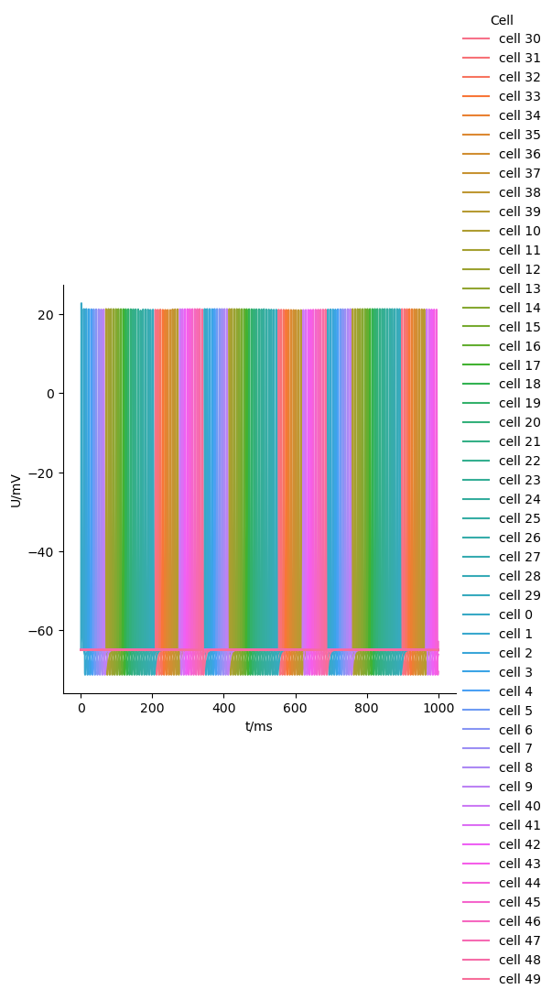

.. _tutorialmpi:

MPI
==============

In this example, the ring network created in an :ref:`earlier tutorial <tutorialnetworkring>` will be used to run in a distributed context using MPI. Only the difference with that tutorial will be described.

.. Note::

   **Concepts covered in this example:**

   1. Building a basic MPI aware :py:class:`arbor.context` to run a network.
      This requires that you have built Arbor with MPI support enabled.
   2. Running the simulation and extract the results.

The recipe
**********

Step **(11)** is changed to generate a network with a thousand cells.

.. code-block:: python

   # (11) Instantiate recipe
   ncells = 500
   recipe = ring_recipe(ncells)

The hardware context
********************

Step **(12)** uses the Arbor-built-in :py:class:`MPI communicator <arbor.mpi_comm>`, which identical to the
``COMM_WORLD`` communicator you'll know if you are familiar with MPI. The :py:class:`arbor.context` takes it as an
argument to the ``mpi`` parameters. Note that you can also pass in communicators created with ``mpi4py``.
We print both the communicator and context to observe how Arbor configures their defaults.

.. code-block:: python

   # (12) Create an MPI communicator, and use it to create a hardware context
   comm = arbor.mpi_comm()
   print(comm)
   context = arbor.context(mpi=comm)
   print(context)

The execution
*************

Step **(16)** runs the simulation. Since we have more cells this time, which are connected in series, it will take some time for the action potential to propagate. In the :ref:`ring network <tutorialnetworkring>` we could see it takes about 5 ms for the signal to propgate through one cell, so let's set the runtime to ``5*ncells``.

.. code-block:: python

   # (16) Run simulation
   sim.run(ncells*5)
   print('Simulation finished')

An important change in the execution is how the script is run. Whereas normally you run the Python script by passing it as an argument to the ``python`` command, you need to use ``srun`` or ``mpirun`` (depending on your MPI distribution) to execute a number of jobs in parallel. You can still execute the script using ``python``, but then MPI will not execute on more than one node.

From the commandline, we can run the script using ``mpirun`` or ``srun`` and specify the number of ranks (``NRANKS``) or nodes. Arbor will spread the cells evenly over the ranks, so with ``NRANKS`` set to 5, we'd be spreading the 500 cells over 5 nodes, calculating 100 cells each.

.. code-block::

   srun -n NRANKS python network_ring_mpi.py
   mpirun -n NRANKS python network_ring_mpi.py

The results
***********

Before we execute the simulation, we have to understand how Arbor distributes the computational load over the ranks
and executes the rest of the script. You can visualize this as a fork from the moment :py:func:`arbor.simulation.run`
is reached. Here the computational load will be distributed and the subsequent execution of the script be different.
This is relevant as to the collection of results: these are not gathered for you. Remember that in step **(14)** we
store the handles to the probes; these referred to particular ``gid``s. The ``gid``s are now distributed, so on one
node, the script will not find the cell referred to by the handle and therefore return an empty list (no results were found).

In step **(18)** we check if the list has a nonzero length, so we can collect the results generated on this particular node. Since Arbor does not collect the results automatically, we have to write the results to disk and analyse them later. We generate a random string to use in the filename where the result is stored.

.. code-block:: python

   # (18) Store the recorded voltages
   print("Storing results ...")
   df_list = []
   for gid in range(ncells):
      if len(sim.samples(handles[gid])):
         samples, meta = sim.samples(handles[gid])[0]
         df_list.append(pandas.DataFrame({'t/ms': samples[:, 0], 'U/mV': samples[:, 1], 'Cell': f"cell {gid}"}))

   if len(df_list):
      df = pandas.concat(df_list)
      df.to_csv(f"result_mpi_{random.randrange(1e10)}.csv", float_format='%g')

In a second script, ``mpi_plot.py``, we load the results stored to disk into a pandas table, and plot the concatenated table as before:

.. code-block:: python

   import glob
   import pandas, seaborn

   results = glob.glob("result_mpi_*.csv")

   df_list = []
   for result in results:
      df_list.append(pandas.read_csv(result))

   df = pandas.concat(df_list)
   seaborn.relplot(data=df, kind="line", x="t/ms", y="U/mV",hue="Cell",ci=None).savefig('mpi_result.png')

We plot the results using pandas and seaborn (it's a bit crowded!):

The full code
*************

You can find the full code of the example at ``python/examples/mpi.py`` and ``python/examples/mpi_plot.py``.
