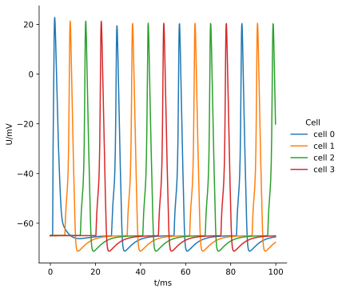

.. _tutorialnetworkring:

A ring network
==============

In this example, a small *network* of cells, arranged in a ring, will be created and the simulation distributed over multiple threads or GPUs if available.

.. Note::

   **Concepts covered in this example:**

   1. Building a basic :py:class:`arbor.cell` with a synapse site and spike generator.
   2. Building a :py:class:`arbor.recipe` with a network of interconnected cells.
   3. Running the simulation and extract the results.

The cell
********

Step **(1)** shows a function that creates a simple cell with a dendrite.
We construct the following :term:`morphology` and label the soma and dendrite:

.. figure:: ../gen-images/tutorial_network_ring_morph.svg
   :width: 400
   :align: center

   A 4-segment cell with a soma (pink) and a branched dendrite (light blue).

.. literalinclude:: ../../python/example/network_ring.py
   :language: python
   :lines: 20-46

In step **(2)** we create a :term:`label` for both the root and the site of the synapse.
These locations will form the endpoints of the connections between the cells.

.. figure:: ../gen-images/tutorial_network_ring_synapse_site.svg
   :width: 400
   :align: center

   We'll create labels for the root (red) and a synapse_site (black).

.. literalinclude:: ../../python/example/network_ring.py
   :language: python
   :lines: 48-58

After we've created a basic :py:class:`arbor.decor`, step **(3)** places a synapse with an exponential decay (``'expsyn'``) on the ``'synapse_site'``.
The synapse is given the label ``'syn'``, which is later used to form :py:class:`arbor.connection` objects terminating *at* the cell.

.. Note::
   Mechanisms can be initialized with their name; ``'expsyn'`` is short for ``arbor.mechanism('expsyn')``.
   Mechanisms typically have some parameters, which can be queried (see :py:class:`arbor.mechanism_info`) and set
   (see :py:class:`arbor.mechanism`). In particular, the ``e`` parameter of ``expsyn`` defaults to ``0``, which makes it,
   given the typical resting potential of cell membranes of ``-70 mV``, an excitatory synapse.

Step **(4)** places a threshold detector at the ``'root'``. The detector is given the label ``'detector'``, which is later used to form
:py:class:`arbor.connection` objects originating *from* the cell.

.. Note::

   The number of synapses placed on the cell in this case is 1, because the ``'synapse_sites'`` locset is an explicit location.
   Had the chosen locset contained multiple locations, an equal number of synapses would have been placed, all given the same label ``'syn'``.

   The same explanation applies to the number of detectors on this cell.

.. literalinclude:: ../../python/example/network_ring.py
   :language: python
   :lines: 60-69

The recipe
**********

To create a model with multiple connected cells, we need to use a :py:class:`recipe <arbor.recipe>`.
The recipe is where the different cells and the :ref:`connections <interconnectivity>` between them are defined.

Step **(5)** shows a class definition for a recipe with multiple cells. Instantiating the class requires the desired
number of cells as input. Compared to the :ref:`simple cell recipe <tutorialsinglecellrecipe>`, the main differences
are connecting the cells **(8)**, returning a configurable number of cells **(6)** and returning a new cell per ``gid`` **(7)**.

Step **(8)** creates an :py:class:`arbor.connection` between consecutive cells. If a cell has gid ``gid``, the
previous cell has a gid ``(gid-1)%self.ncells``. The connection has a weight of 0.01 (inducing a conductance of 0.01 μS
in the target mechanism ``expsyn``) and a delay of 5 ms.
The first two arguments to :py:class:`arbor.connection` are the **source** and **target** of the connection.

The **source** is a :py:class:`arbor.cell_global_label` object containing a cell index ``gid``, the source label
corresponding to a valid detector label on the cell and an optional selection policy (for choosing a single detector
out of potentially many detectors grouped under the same label - remember, in this case the number of detectors labeled
'detector' is 1).
The :py:class:`arbor.cell_global_label` can be initialized with a ``(gid, label)`` tuple, in which case the selection
policy is the default :py:attr:`arbor.selection_policy.univalent`; or a ``(gid, (label, policy))`` tuple.

The **target** is a :py:class:`arbor.cell_local_label` object containing a cell index ``gid``, the target label
corresponding to a valid synapse label on the cell and an optional selection policy (for choosing a single synapse
out of potentially many synapses grouped under the same label - remember, in this case the number of synapses labeled
'syn' is 1).
The :py:class:`arbor.cell_local_label` can be initialized with a ``label`` string, in which case the selection
policy is the default :py:attr:`arbor.selection_policy.univalent`; or a ``(label, policy)`` tuple. The ``gid``
of the target cell doesn't need to be explicitly added to the connection, it is the argument to the
:py:func:`arbor.recipe.connections_on` method.

Step **(9)** attaches an :py:class:`arbor.event_generator` on the 0th target (synapse) on the 0th cell; this means it
is connected to the ``"synapse_site"`` on cell 0. This initiates the signal cascade through the network. The
:class:`arbor.explicit_schedule` in instantiated with a list of times in milliseconds, so here a single event at the 1
ms mark is emitted. Note that this synapse is connected twice, once to the event generator, and once to another cell.

Step **(10)** places a :term:`probe` at the ``"root"`` of each cell.

Step **(11)** instantiates the recipe with 4 cells.

.. literalinclude:: ../../python/example/network_ring.py
   :language: python
   :lines: 74-122

The execution
*************

To create a simulation, we need at minimum to supply the recipe, and in addition can supply a :class:`arbor.context`
and :py:class:`arbor.domain_decomposition`. The first lets Arbor know what hardware it should use, the second how to
destribute the work over that hardware. By default, contexts are configured to use 1 thread and domain decompositons to
divide work equally over all threads.

Step **(12)** initalizes the ``threads`` parameter of :class:`arbor.context` with the ``avail_threads`` flag. By supplying
this flag, a context is constructed that will use all locally available threads. On your local machine this will match the
number of logical cores in your system. Especially with large numbers
of cells you will notice the speed-up. (You could instantiate the recipe with 5000 cells and observe the difference. Don't
forget to turn of plotting if you do; it will take more time to generate the image then to run the actual simulation!)
If no domain decomposition is specified, a default one distributing work equally is created. This is sufficient for now.
You can print the objects to see what defaults they produce on your system.

Step **(13)** sets all spike generators to record using the :py:class:`arbor.spike_recording.all` policy.
This means the timestamps of the generated events will be kept in memory. Be default, these are discarded.

In addition to having the timestamps of spikes, we want to extract the voltage as a function of time.

Step **(14)** sets the probes (step **10**) to measure at a certain schedule. This is sometimes described as
attaching a :term:`sampler` to a :term:`probe`. :py:func:`arbor.simulation.sample` expects a :term:`probeset id` and the
desired schedule (here: a recording frequency of 10 kHz, or a ``dt`` of 0.1 ms). Note that the probeset id is a separate index from those of
:term:`connection` endpoints; probeset ids correspond to the index of the list produced by
:py:func:`arbor.recipe.probes` on cell ``gid``.

:py:func:`arbor.simulation.sample` returns a handle to the :term:`samples <sample>` that will be recorded. We store
these handles for later use.

Step **(15)** executes the simulation for a duration of 100 ms.

.. literalinclude:: ../../python/example/network_ring.py
   :language: python
   :lines: 124-136

The results
***********

Step **(16)** prints the timestamps of the spikes:

.. literalinclude:: ../../python/example/network_ring.py
   :language: python
   :lines: 138-141

Step **(17)** generates a plot of the sampling data.
:py:func:`arbor.simulation.samples` takes a ``handle`` of the probe we wish to examine. It returns a list
of ``(data, meta)`` terms: ``data`` being the time and value series of the probed quantity; and
``meta`` being the location of the probe. The size of the returned list depends on the number of
discrete locations pointed to by the handle, which in this case is 1, so we can take the first element.
(Recall that in step **(10)** we attached a probe to the ``"root"``, which describes one location.
It could have described a :term:`locset`.)

.. literalinclude:: ../../python/example/network_ring.py
   :language: python
   :lines: 143-

Since we have created ``ncells`` cells, we have ``ncells`` traces. We should be seeing phase shifted traces, as the action potential propagated through the network.

We plot the results using pandas and seaborn:

The full code
*************

You can find the full code of the example at ``python/example/network_ring.py``.
