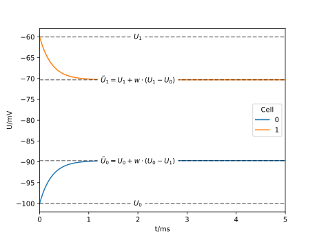

.. _tutorialtwocellsgapjunction:

Two cells connected via a gap junction
======================================

In this example, we will set up two cells connected via a gap junction.
The cells have different leak potentials.
We will investigate how the equilibrium potentials of the two cells change because of the gap junction connection.

    The equivalent circuit used to calculate the equilibrium potentials.

.. Note::

   **Concepts covered in this example:**

   1. Creating a simulation recipe for two cells.
   2. Placing probes.
   3. Running the simulation and extracting the results.
   4. Adding a gap junction connection.

Walk-through
************

We set up a recipe for the simulation of two cells

.. literalinclude:: ../../python/example/network_two_cells_gap_junctions.py
   :language: python
   :lines: 13-45

in which we store the relevant parameters for the two cells, all of which are
shared except the equilibrium potentials in ``Vms``. Next, we define callbacks
to define our cell population:

- ``num_cells`` returns the number of cells in the network, ie 2
- ``cell_kind`` specifies that we handle ``cable_cell`` exclusively.
- ``global_properties`` returns a list of standard parameters based on the defaults of the NEURON simulator.
- ``cell_description`` member function constructs the morphology and sets the properties of the cells as well as the gap junction mechanisms and the discretization policy. It returns the finished ``cable_cell``, matching the ``cell_kind`` callback.

.. literalinclude:: ../../python/example/network_two_cells_gap_junctions.py
   :language: python
   :lines: 49-93

We build the network conections, here a single, bidirectional gap junction

.. literalinclude:: ../../python/example/network_two_cells_gap_junctions.py
   :language: python
   :lines: 97-105

And, finally, we return a set of probes which are passed in during construction

.. literalinclude:: ../../python/example/network_two_cells_gap_junctions.py
   :language: python
   :lines: 108-109

We parse the command line arguments which are used to set parameters in the recipe

.. literalinclude:: ../../python/example/network_two_cells_gap_junctions.py
   :language: python
   :lines: 113-147

Next, we define a list of probes and construct the recipe and simulation

.. literalinclude:: ../../python/example/network_two_cells_gap_junctions.py
   :language: python
   :lines: 149-154

Having set up the simulation, we setting probe sampling on a regular grid with
width equal to the timestep :math:`dt`. Now, we can run it and access the sampling values

.. literalinclude:: ../../python/example/network_two_cells_gap_junctions.py
   :language: python
   :lines: 156-178

All that is left to do is to put this into a plot. The output plot below shows
how the potential of the two cells approaches their equilibrium potentials

.. math::

   \bar U_i = U_i + w(U_i - U_j)

   w = \frac{\rho + g}{2 \rho + g}

The full code
*************

You can find the full code of the example at ``python/examples/network_two_cells_gap_junctions.py``

Executing the script will run the simulation with default parameters.
