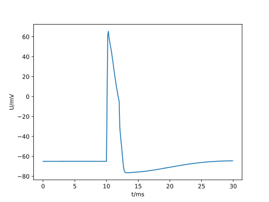
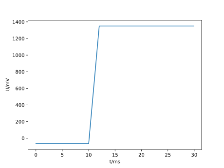
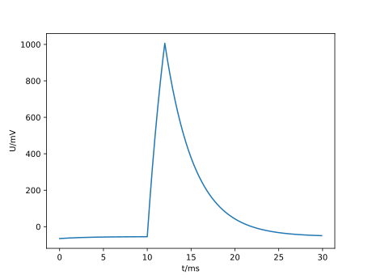
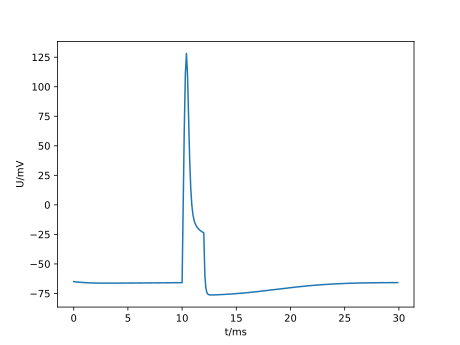

.. _tutorial_nmodl_density:

How to use NMODL to extend Arbor's repertoire of Ion Channels
=============================================================

NMODL is Arbor's way of expressing ion channel dynamics, which in turn can be
added to cable cells via the :ref:`decor` interface. This tutorial will guide
you through to create such an ion channel from scratch. Note that there are
already large selections of channels built into Arbor in addition to online
databases of ready-to-use models. Please check there first and only if you find
nothing to use or adapt, try to build your own. If you want to learn how to use
ion channels, consider other tutorials first, such as
:ref:`tutorialsinglecellrecipe` and the dynamic catalogue example.

Introducing NMODL
-----------------

NMODL is a domain specific language (DSL) for design electro-chemical dynamics
deriving from the earlier MODL language. It is used by Arbor, Neuron, and
CoreNeuron. Although each software has its own dialect, the core ideas are
identical. Unfortunately, documentation for both NMODL and MODL is scarce and
outdated. This tutorial aims to help you become proficient in writing and adapting ion
channels for Arbor. Note that while we focus on density mechanisms here, there
is a host of behaviours customisable in Arbor through NMODL in addition to
wholly new functionality, examples include gap junctions, synapses, and voltage
clamps. NMODL can use stochastic differential equations and modify ion
concentrations.

The running example: Hodgkin-Huxley
-----------------------------------

During this tutorial, we will re-implement the classic Hodgkin-Huxley ion
channel model. You can use it directly in Arbor as ``hh`` from the default
catalogue, but for this tutorial, we pretend that it is an entirely new model.

We begin by setting up a simple model using the default ``hh`` model

.. literalinclude:: ../../python/example/hh/step-01.py
  :language: python

Store it in ``step-01.py`` and --- once run --- is should produce a plot like
this:

You can find all steps in the ``python/example/hh`` directory in Arbor's source code.

Starting out: Loading our own catalogue
---------------------------------------

Next, we have to do multiple things in parallel

1. create our own channel
2. build a catalogue containing said channel
3. update the example accordingly

We start by creating a new directory ``mod`` (the name is not important, but
will be used throughout this example) and adding a file named ``hh02.mod`` to
it. Its contents should be this:

.. literalinclude:: ../../python/example/hh/mod/hh02.mod

We will discuss this in detail below, but for now, we will just translate and
use it in our model. Change to a shell, next to the ``mod`` directory and type:

.. code-block:: bash

   arbor-build-catalogue cat mod

and an output like this should appear (again ``cat`` is an arbitrary name we
will use from here on).

.. code-block:: bash

    Building catalogue 'cat' from mechanisms in /Users/hater/src/arbor/python/example/hh/mod
     * NMODL
       * hh02
    Catalogue has been built and copied to /Users/hater/src/arbor/python/example/hh/cat-catalogue.so

and the file ``cat-catalogue.so`` should appear in your current directory. Next, modify the Python file
like this:

.. literalinclude:: ../../python/example/hh/step-02.py
  :language: python

This should --- once run --- produce a plot like this:

You can find all the steps in the ``python/example/hh`` directory in Arbor's source
code. Let's return to what just happened, it's quite a bit. First, we added our
ion channel and used ``arbor-build-catalogue`` to translate it into a form Arbor
can utilize. These collections of ion channels are --- unsurprisingly --- called
catalogues, see :ref:`mechanisms`. We pulled this into our model by loading and
assigning it to the model.

Next, let's look at the output graph. We observe a sudden jump in potential
during the period the current clamp is active. As Arbor's model for a single CV
cable cell is :math:`\partial_t U_m = i_e - i_m` (for multi-CV cells, we have
additional terms that can be neglected here, see :ref:`cable_cell`), this
behaviour is expected. The current clamp provides a positive :math:`i_e` and our
ion channel model supplies the trans-membrane current :math:`i_m = 0`. To
understand the latter part, consider the channel model file we just added

.. literalinclude:: ../../python/example/hh/mod/hh02.mod
  :lines: 1-4

This is the ``NEURON`` block declaring the channel's name, here ``hh02``, which
is used when  channels from a catalogue. Files that put ``SUFFIX`` in
front of the name are converted to density channels, as opposed to synapses
(``POINT_PROCESS``) and gap junctions (``JUNCTION_PROCESS``). In addition to
naming the channel, we also need to set up all variables used to interface with
Arbor, namely ion currents, ion concentrations, ion reversal potentials, and
non-ion currents. While the ion variables follow a rigid naming scheme, which we
will discuss later, non-ion currents can be freely named after
``NONSPECIFIC_CURRENT``. We chose ``il`` here, alluding to 'leak current'.
Semantically, these currents are considered to be unassociated to any specific
ion and thus can represent all ion currents we do not model explicitly as a lump
sum. When computing ``i_m`` for the cable equation above, Arbor takes the sum
over all non-specific and ion currents across all ion channels on the
current CV. We will revisit the ``NEURON`` multiple times later on, but for now
we turn to:

.. literalinclude:: ../../python/example/hh/mod/hh02.mod
  :lines: 6-8

During the integration of the cable equation, Arbor will evaluate this block to
update its internal picture of the currents, i.e. to calculate ``i_m``. This
occurs at an unspecified moment of the execution and might even be done multiple
times, so we need to take care not to depend on the execution order. We are
_expected_, yet not forced by the tooling, to update all such outputs, so, again,
some care is needed.

Stepping Stone: Leak
--------------------

As you might have anticipated, our next step is to produce a finite current to
counteract any disturbance in the membrane potential. So, we start by adding a
new mechanism to ``mod``, called ``hh03``, which is just a copy of ``hh02.mod``.
Next, adjust ``SUFFIX hh02`` to ``SUFFIX hh03``. Similarly copy ``step-02.py``
to ``step-03.py`` and change

.. literalinclude:: ../../python/example/hh/step-03.py
  :language: python
  :lines: 11-16

as well as ``plt.savefig('hh-03.pdf')``. From on out, we'll assume the following
steps are completed at the beginning of each new section:

1. Copy ``step-n.py`` to ``step-(n+1).py``

   - update all references to ``hhn`` to ``hh(n+1)``
   - update the output image to ``hh-(n+1).pdf``
2. Copy ``mod/hhn.mod`` to ``mod/hh(n+1).mod``

   - change the name to ``SUFFIX hh(n+1)``
3. Start editing the new NMODL and Python files.

   - After each change to the NMODL file, you'll need to call ``arbor-build-catalogue cat mod``

Keep this in mind while we start altering the NMODL file to produce a more
sensible current. Let's start with the current itself:

.. literalinclude:: ../../python/example/hh/mod/hh03.mod
  :lines: 11-13

This will pull the membrane potential ``v`` towards a resting potential ``el``
since our reduced cable equation is now :math:`\partial_t U_m = i_e - g_l\cdot(U_m -
E_l)`. The membrane potential is available in NMODL as a read-only built-in
symbol ``v`` and can be used in any ion channel. However, we need a way to set
the resting potential ``el`` and the conductivity ``gl``. This is accomplished
by adding a new block to the NMODL file:

.. literalinclude:: ../../python/example/hh/mod/hh03.mod
  :lines: 6-10

These parameters have an optional default value and a likewise optional unit.
Both are helpful to have, though. The units chosen internally by Arbor come
together such that the conductivity *must* have units ``S/cm2``. Note that there
is neither a check nor a conversion of units; the annotation serves purely as a
reminder. Now, running the example ``step-03.py`` gives us the expected
result of the membrane potential returning to the resting value:

We have now recreated the leak current from the HH neuron model, which is one of
three currents needed. Before we turn to the other two, though, we'll apply some
polish. Variables declared in ``PARAMETER`` blocks can be set in the call to
``paint``, like so:

.. code-block:: python

    decor = (
        A.decor()
        .paint('(all)', A.density('hh03', g=0.0005, el=-70))
        .place('(location 0 0.5)', A.iclamp(10 * U.ms, 2 * U.ms, 0.8 * U.nA), "iclamp")
    )

To enable this, we need to tell NMODL that each CV will have its own value of
``gl`` and ``el``, via

.. literalinclude:: ../../python/example/hh/mod/hh03.mod
  :lines: 1-5

Without this addition, there would be one global copy for each, which could be
set by writing

.. code-block:: python

    decor = (
        A.decor()
        .paint('(all)', A.density('hh03/el=-70,gl=0.0005'))
        .place('(location 0 0.5)', A.iclamp(10 * U.ms, 2 * U.ms, 0.8 * U.nA), "iclamp")
    )

instead. Parameters are either ``GLOBAL`` or ``RANGE``, never both. The
difference is subtle and non-existent for our single CV. The rule of thumb is
that if you expect a parameter to vary smoothly across the neuron, make it
``RANGE`` and if you expect discrete, clearly delineated regions with
discontinuous values, go for ``GLOBAL``. Comparing the performance impact of parameters, ``GLOBAL`` is more efficient than ``RANGE``.
While ``RANGE`` parameters consume one memory location (and access) per CV, those tagged ``GLOBAL``
require only one location (and access) *regardless* of CV count. Thus, all things being equal, prefer ``GLOBAL``.

Differential Equations in NMODL
-------------------------------

After observing the ceremony of making copies of both Python and NMODL once
more, we turn to the final task. There are currents left to handle in the HH
model for potassium and sodium ions. Their formulations are quite similar,
so we will discuss the potassium current here and leave the sodium current
as an exercise

.. math::

    i_{na} = \bar g_{na} m^3 h (v - E_{na})\\
    i_{k} = \bar g_{k} n^4(v - E_{k})

In these equations, three new variables appear: :math:`m, h, n`, which are
defined via differential equations

.. math::

    n' = \alpha_{n}(v) (1 - n) - \beta_{n}(v)n\\
    m' = \alpha_{m}(v) (1 - m) - \beta_{m}(v)m\\
    h' = \alpha_{h}(v) (1 - h) - \beta_{h}(v)h

The coefficients :math:`\alpha_{m,h,n}` and :math:`\alpha_{m,h,n}` are in turn

.. math::

    \alpha_{x}(v) = \frac{x_{\infty}(v)}{\tau_{x}}\\
    \beta_{x}(v) = \frac{1 - x_{\infty}(v)}{\tau_{x}}

where the steady state activations :math:`m,h,n_\infty` can be determined by
fitting. We will simply use them in NMODL without further justification. Add
this to (the end of) ``hh04.mod``:

.. literalinclude:: ../../python/example/hh/mod/hh04.mod
  :lines: 49-55

The ``FUNCTION`` construct introduces a function which can only access its
parameters and can have no side-effects like writing to global variables. Its
return value is set by formally assigning a value to the function's name.
Arbor provides some builtin functions like ``exprelr``, which is used here,
and returns

.. math::

   \mathrm{exprelr}(x) = \frac{x}{\exp(x) - 1}

and its smooth continuation over :math:`x=0`. ``exprelr`` is useful in many
models similar to HH.

Now we turn to formulating the differential equations (ODE). Naively, we could
be tempted to add something like this to the ``BREAKPOINT`` block (notice the
``LOCAL`` keyword to declare block-local variables)

.. code-block::

    BREAKPOINT {
        LOCAL alpha, beta

        alpha = n_alpha(v)
        beta  = n_beta(v)
        n     = n + dt*(alpha - n*(alpha + beta))

        ik = gkbar*n*n*n*n*(v - ek)
        il = gl*(v - el)
    }

and attempt to solve the ODE manually via Euler's method. Alas, this is
inconvenient and cumbersome as we needed to adapt the ion channel's ``paint``
call every time we change the time step ``dt`` (assuming we pass it as a
parameter). It's also less accurate than desirable. What's more, as we don't
know the order and count of evaluation of these blocks, it's also likely to be
incorrect.

There is, though, a better way by using a new variable kind, the ``STATE``
variable. Add this in your NMODL file

.. literalinclude:: ../../python/example/hh/mod/hh04.mod
  :lines: 11-12,30-37

Now we have told NMODL how to compute the derivative of ``n``. For an initial
value problem, we also need to add its initial value and actually *solve*
the ODE. This is achieved by

.. literalinclude:: ../../python/example/hh/mod/hh04.mod
  :lines: 21-29,39-47

For closing the loop, we need to adjust the ``NEURON`` block once more:

.. literalinclude:: ../../python/example/hh/mod/hh04.mod
  :lines: 1-9

This is how we add ionic currents in NMODL. There's a list of predefined ions
(sodium ``na``, potassium ``k``, and calcium ``ca``) and new ones can be added
via ``set_ion``. The variable names in use here follow a strict naming scheme:
For a hypothetical ion ``X``, the following variables are defined:

- ``iX`` the current
- ``eX`` the reversal potential
- ``Xi`` the internal concentration
- ``Xo`` the external concentration

Their default values can be set in the simulation using ``set_ion``.
We can run the simulation again to obtain:

Final Polish: Temperature
-------------------------

A common problem is that measurements are often taken at temperatures different
from the natural environment of a neuron. This is fixed by adjusting for the
difference. For us, it presents an opportunity to introduce the ``ASSIGNED``
construct. Like ``STATE`` variables, ``ASSIGNED`` variables persist across
blocks. Unlike ``STATE`` variables, we cannot take their derivative. We
reproduce ``hh05.mod`` here as a reference.

.. literalinclude:: ../../python/example/hh/mod/hh05.mod

Things to take note of here is ``celsius``, which contains the temperature in
degrees Celsius. While it is listed as ``PARAMETER`` here, it is not a real
parameter but rather a built-in variable. Adding it to ``PARAMETER`` makes it
available in the NMODL file. Adding the potential here, too, is not required but is considered good form. Using ``ASSIGNED`` over ``LOCAL`` here is again a
performance consideration. While costing memory capacity and operations, the
exponentiation is expensive enough to warrant the expense. This simulation
results in:

Your own Journey
----------------

Now, you are free to either explore implementing ``ina`` on your own or to
look up how we did it in ``hh06.mod`` and ``step-06.py``.

If you want to try it but need a hint, here's a rough outline:

1. Add a declaration of the sodium ion and its variables  to the ``NEURON`` block
2. Add a parameter for the conductivity
3. Compute the sodium current in ``BREAKPOINT``
4. Add *two* new ``STATE`` variables ``h`` and ``m``
5. Formulate their ODEs in ``INITIAL`` and ``DERIVATIVE``, one block can compute
   all derivatives simultaneously.

Conclusion
----------

You have probably picked up some of the quirks in syntax and semantics of NMODL.
Let us be blunt: NMODL isn't anyone's idea of a favourite language. So, why
should you be investing time in learning it? The answer is simply that it serves
as the basis for all complex networks as simulated by Arbor or Neuron. Even
modern attempts at addressing the same problems, like NeuroML2, are translated
into NMODL. Almost all existing models are rooted in NMODL.

We did introduce the most relevant constructs here, with some notable exceptions
like ``KINETIC`` and ``NET_RECEIVE``. We will possibly return to them in the
future. Note that NMODL is significantly more complex than we have shown here,
but these constructs can be avoided almost entirely and/or do not apply to
Arbor.

Synapses in NMODL
=================

If you have followed the tutorial above, there isn't much more to know before
you can write your own synapse models. Thus, we will just show and discuss
the exponential synapse coming with Arbor.

.. literalinclude:: ../../mechanisms/default/expsyn.mod

The differences in density mechanisms like ``hh`` are fairly minimal on the
surface; instead of ``SUFFIX``, we write ``POINT_PROCESS`` in front of the name.
The rest can be summarised as follows: We have a non-specific current ``i``
driving the model towards the resting potential ``e``, which is proportional to
the conductivity ``g``. The conductivity ``g`` itself decays exponentially
towards zero with time constant ``tau``. One subtle difference is the unit for
currents; where density mechanisms output a *current density* of ``mA/cm2``
(thus ``g`` in ``hh`` above has unit ``S/cm2``) point mechanisms directly
produce a current in units of ``nA``, resulting in units ``uS`` for ``g``.

One new block ``NET_RECEIVE``, which is exclusive to ``POINT_PROCESS``, makes
its appearance. It is evaluated every time an event is dispatched to the
synapse, which might be never, once, or even multiple times during a time step,
depending on the surrounding network state. This evaluation is done in
unspecified order w.r.t. to ``BREAKPOINT``, i.e. before, after, or both.
However, as this is specifically to handle events, Arbor will evaluate this
block *exactly* once per event, so the advice about ``BREAKPOINT`` and multiple
evaluation does not apply to ``NET_RECEIVE``.

The formal parameter ``weight`` contains the connection weight according to the
connection along which the action potential being processed was transmitted. To
put this into the larger context, we sketch the infrastructure used to tie
synapses and connections into a model:

.. code-block:: python

   class recipe(A.recipe):
       def __init__(self, ncells):
           A.recipe.__init__(self)

       def num_cells(self):
           return 2

       def cell_description(self, gid):
           tree = A.segment_tree()
           tree.append(A.mnpos, (-3, 0, 0, 3), (3, 0, 0, 3), tag=1)
           # syn and det form the targets and sources for connections.
           decor = (
               A.decor()
               .paint('(all)', A.density("hh"))
               .place('(location 0 0.5)', A.synapse("expsyn"), "syn")
               .place('(location 0 0.5)', A.threshold_detector(-10 * U.mV), "det")
           )
           return A.cable_cell(tree, decor)

       def cell_kind(self, _):
           return A.cell_kind.cable

       def connections_on(self, gid):
           # gid 0 is purely a source
           if gid == 0:
               return []
           # gid 1 has an incoming connection from gid 0
           # any spike dispatched to syn will trigger NET_RECEIVE on expsyn with weight=0.01
           return [A.connection((0, "det"), "syn", 0.01, 5 * U.ms)]

       def global_properties(self, _):
           return A.neuron_cable_properties()

This concludes our look at synapses or ``POINT_PROCESS`` es. NMODL has more to
offer, like the ability to formulate ``KINETIC`` reaction systems, and Arbor
adds some extensions, e.g. voltage processes, longitudinal diffusion, support
for STDP, and mechanisms for gap junctions.
