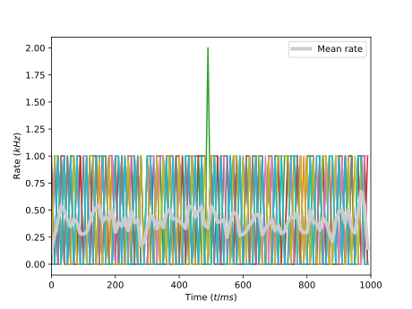
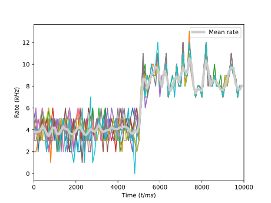

.. _tutorial_plasticity:

Structural Plasticity in Arbor
==============================

In this tutorial, we are going to demonstrate how a network can be built using
plasticity and homeostatic connection rules. Despite not playing towards Arbor's
strengths, we choose a LIF (Leaky Integrate and Fire) neuron model, as we are
primarily interested in examining the required scaffolding.

We will build up the simulation in stages, starting with an unconnected network
and finishing with a dynamically built connectome.

.. admonition:: Concepts and Requirements

    We cover some advanced topics in this tutorial, mainly structural
    plasticity. Please refer to other tutorials for the basics of network
    building. The model employed here --- storing an explicit connection matrix
    --- is not advisable in most scenarios.

    In addition to Arbor and its requirements, ``scipy``, ``matplotlib``, and
    ``networkx`` need to be installed.

Unconnected Network
-------------------

Consider a collection of ``N`` LIF cells. This will be the starting point for
our exploration. For now, we set up each cell with a Poissonian input such that
it will produce spikes periodically at a low frequency.

The Python file ``01-setup.py`` is the scaffolding we will build our simulation
around and thus contains some passages that might seem redundant now, but will
be helpful in later steps.

We begin by defining the global settings:

.. literalinclude:: ../../python/example/plasticity/unconnected.py
  :language: python
  :lines: 7-15

- ``N`` is the cell count of the simulation.
- ``T`` is the total runtime of the simulation in ``ms``.
- ``t_interval`` defines the _interval_ such that the simulation advances in
  discrete steps ``[0, 1, 2, ...] t_interval``. Later, this will be the timescale of
  plasticity.
- ``dt`` is the numerical timestep on which cells evolve.

These parameters are used here:

.. literalinclude:: ../../python/example/plasticity/unconnected.py
  :language: python
  :lines: 52-62

where we run the simulation in increments of ``t_interval``.

Back to the recipe, we set a prototypical cell:

.. literalinclude:: ../../python/example/plasticity/unconnected.py
  :language: python
  :lines: 23

and deliver it for all ``gid``:

.. literalinclude:: ../../python/example/plasticity/unconnected.py
  :language: python
  :lines: 42-43

Also, each cell has an event generator attached, using a Poisson point process seeded with the cell's ``gid``.

.. literalinclude:: ../../python/example/plasticity/unconnected.py
  :language: python
  :lines: 33-40


All other parameters are set in the constructor:

.. literalinclude:: ../../python/example/plasticity/unconnected.py
  :language: python
  :lines: 19-28

We also proceed to add spike recording and generate plots using a helper
function ``plot_spikes`` from ``util.py``. You can skip the following details
for now and come back later if you are interested in how it works. Rates are
computed by binning spikes into ``t_interval`` and the neuron id; the mean rate
is the average across the neurons smoothed using a Savitzky-Golay filter
(``scipy.signal.savgol_filter``).

We plot per-neuron and mean rates:



We also generate raster plots via ``scatter``:


A Randomly Wired Network
------------------------

We use inheritance to derive a new recipe that contains all the functionality of
the ```unconnected`` recipe. We then add a random connectivity matrix during
construction, fix connection weights, and deliver the resulting connections
via the ``connections_on`` callback, with the only extra consideration of
allowing multiple connections between two neurons.

In detail, the recipe stores the connection matrix, the current
incoming/outgoing connections per neuron, and the maximum for both directions

.. literalinclude:: ../../python/example/plasticity/random_network.py
  :language: python
  :lines: 26-31

The connection matrix is used to construct connections,

.. literalinclude:: ../../python/example/plasticity/random_network.py
  :language: python
  :lines: 33-38

together with the fixed connection parameters:

.. literalinclude:: ../../python/example/plasticity/random_network.py
  :language: python
  :lines: 24-25

We define helper functions ``add|del_connections`` to manipulate the connection
table while upholding these invariants:

- no self-connections, i.e., ``connection[i, i] == 0``
- ``inc[i]`` the sum of ``connections[:, i]``
- no more incoming connections than allowed by ``max_inc``, i.e., ``inc[i] <= max_inc``
- ``out[i]`` the sum of ``connections[i, :]``
- no more outgoing connections than allowed by ``max_out``, i.e., ``out[i] <= max_out``

These methods return ``True`` on success and ``False`` otherwise.

.. literalinclude:: ../../python/example/plasticity/random_network.py
  :language: python
  :lines: 40-54

Both are used in ``rewire`` to produce a random connection matrix.

.. literalinclude:: ../../python/example/plasticity/random_network.py
  :language: python
  :lines: 56-65

We then proceed to run the simulation:

.. literalinclude:: ../../python/example/plasticity/random_network.py
  :language: python
  :lines: 68-79

 and plot the results as before:


Note that we added a plot of the network connectivity using ``plot_network``
from ``util`` as well. This generates images of the graph and connection matrix.


Adding Homeostasis
------------------

Under the homeostatic model, each cell was a setpoint for the firing rate :math:`\nu^*`
which is used to determine the creation or destruction of synaptic connections via

.. math::

   \frac{dC}{dt} = \alpha(\nu - \nu^*).

Thus we need to add some extra information to our simulation, namely the
setpoint :math:`\nu^*_i` for each neuron :math:`i` and the sensitivity parameter
:math:`\alpha`. We will also use a simplified version of the differential
equation above, namely adding/deleting exactly one connection if the difference
of observed to desired spiking frequency exceeds :math:`\pm\alpha`. This is both
for simplicity and to avoid sudden changes in the network structure.

As before, we set up global parameters:

.. literalinclude:: ../../python/example/plasticity/homeostasis.py
  :language: python
  :lines: 10-24

and prepare our simulation:

.. literalinclude:: ../../python/example/plasticity/homeostasis.py
  :language: python
  :lines: 37-39

Note that our new recipe is almost unaltered from the random network.

.. literalinclude:: ../../python/example/plasticity/homeostasis.py
  :language: python
  :lines: 27-33

All changes are contained in the way we run the simulation. To add a further
interesting feature, we skip the rewiring for the first half of the simulation.
The initial network is unconnected, but could be populated randomly (or any
other way) if desired by calling ``self.rewire()`` in the constructor of
``homeostatic_network`` before setting the maxima to eight.

Plasticity is implemented by tweaking the connection table inside the recipe
between calls to ``run`` and calling ``simulation.update`` with the modified
recipe:

.. literalinclude:: ../../python/example/plasticity/homeostasis.py
  :language: python
  :lines: 70

<<<<<<< HEAD
.. note::

   As it is the central point here, it is worth emphasizing why this yields a
   changed network. The call to ``sim.update(rec)`` causes Arbor to internally
   re-build the connection table from scratch based on the data returned by
   ``rec.connections_on``. However, here, this method just inspects the matrix
   in ``rec.connections`` and converts the data into a ``arbor.connection``.
   Thus, changing this matrix before ``update`` will build a different network.

   Important caveats:

   - without ``update``, changes to the recipe have no effect.
   - vice versa ``update`` has no effect if the recipe doesn't return a different
     data than before.
   - ``update`` will delete all existing connections and their parameters, so
     all connections to be kept must be explicitly re-instantiated.
   - ``update`` will **not** delete synapses or their state, e.g., ODEs will
     still be integrated even if not connected and currents might be produced;
   - neither synapses/targets nor detectors/sources can be altered. Create all
     endpoints up front.
   - only the network is updated (this might change in future versions!).
   - be very aware that ``connections_on`` might be called in arbitrary order
     and by multiple (potentially different) threads and processes! This
     requires some thought and synchronization when dealing with random numbers
     and updating data *inside* ``connections_on``.

Changes are based on the difference from the current rate we compute from the spikes
during the last interval,
||||||| parent of df94162f (Final thoughts and warnings.)
Changes are based on the difference of current rate we compute from the spikes
during the last interval
=======
.. note::

   As it is the central point here, it is worth emphasizing why this yields a
   changed network. The call to ``sim.update(rec)`` causes Arbor to internally
   re-build the connection table from scratch based on the data returned by
   ``rec.connections_on``. However, here, this method just inspects the matrix
   in ``rec.connections`` and converts the data into a ``arbor.connection``.
   Thus, changing this matrix before ``update`` will build a different network.

   Important caveats:

   - without ``update``, changes to the recipe have no effect
   - vice versa ``update`` has no effect if the recipe doesn't return different
     data than before
   - ``update`` will delete all existing connections and their parameters, so
     all connections to be kept must be explicitly re-instantiated
   - ``update`` will **not** delete synapses or their state, e.g. ODEs will
     still be integrated even if not connected and currents might be produced
   - neither synapses/targets nor detectors/sources can be altered. Create all
     endpoints up front.
   - only the network is updated (this might change in future versions!)
   - be very aware that ``connections_on`` might be called in arbitrary order
     and by multiples (potentially different) threads and processes! This
     requires some thought and synchronization when dealing with random numbers
     and updating data *inside* ``connections_on``.

Changes are based on the difference of current rate we compute from the spikes
during the last interval
>>>>>>> df94162f (Final thoughts and warnings.)

.. literalinclude:: ../../python/example/plasticity/homeostasis.py
  :language: python
  :lines: 49-54

and the setpoint times the sensitivity.

.. literalinclude:: ../../python/example/plasticity/homeostasis.py
  :language: python
  :lines: 55

Then, each potential pairing of target and source is checked  in random
order for whether adding or removing a connection is required:

.. literalinclude:: ../../python/example/plasticity/homeostasis.py
  :language: python
  :lines: 59-68

If we find an option to fulfill that requirement, we do so and proceed to the
next target. The randomization is important here, especially for adding
connections to avoid biases, in particular when there are too few eligible
connection partners. The ``randrange`` function produces a shuffled range ``[0,
N)``. We leverage the helper functions from the random network recipe to
manipulate the connection table, see the discussion above.

Finally, we plot spiking rates as before; the jump at the half-way point is the
effect of the plasticity activating after which each neuron moves to the
setpoint.



And the resulting network:


Conclusion
----------

This concludes our foray into structural plasticity. While the building blocks

- an explicit representation of the connections;
- running the simulation in batches (and calling ``simulation.update``!);
- a rule to derive the change;

will likely be the same in all approaches, the concrete implementation of the
rules is the centerpiece here. For example, although spike rate homeostasis was
used here, mechanism states and ion concentrations --- extracted via the normal
probe and sample interface --- can be leveraged to build rules. Due to the way
the Python interface is required to link to measurements, using the C++ API for
access to streaming spike and measurement data could help to address performance
issues. Plasticity as shown also meshes with the high-level connection builder.
External tools to build and update connections might be useful as well.
