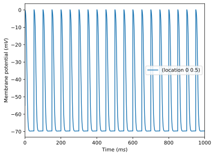
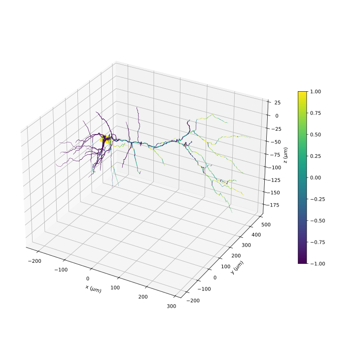
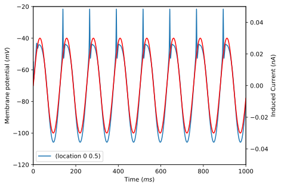

.. _tutorial_external_fields:

Interacting with External Fields
================================

In this tutorial we are going to discuss how to use Arbor and an external simulation
of smooth fields to facilitate interaction at the microscopic level, e.g.

- stimulation by electric fields as induced by direct currents or magnetic fields [#f1]_
- simulations of the extra-cellular medium [#f2]_

As a concrete example, we will model the influence of a time-varying electric
field on a single cell.

This is an experimental technique leaning into the implementation details of
Arbor and ``modcc`` and as such might be changed sooner or later. For a valuable
outcome, readers should be familiar with modeling cable cells in Arbor, NMODL
and its use in Arbor, the basics of electro-dynamics, and some low-level (C++)
programming.

All source code for all intermediate steps can be in the directory
`python/example/reading-external-fields
<https://github.com/arbor-sim/arbor/tree/master/python/example/reading-external-fields>`__
of the Arbor source tree.

Single Cell Model
-----------------

As the first step, we create a single cell model with a sufficiently complex
geometry, following the standard method outlined in for example :ref:`tutorialsinglecellrecipe`

.. literalinclude:: ../../python/example/reading-external-fields/single-cell.py
    :language: python

For convenience and the purposes of this tutorial, we store the actual cable
cell data as global variables outside the recipe

.. literalinclude:: ../../python/example/reading-external-fields/single-cell.py
    :linenos:
    :lineno-match:
    :lines: 9-23
    :language: python

We add a spiking input to the soma centre

.. literalinclude:: ../../python/example/reading-external-fields/single-cell.py
    :linenos:
    :lineno-match:
    :lines: 9
    :language: python

with a regular rate of :math:`\nu = 1/50ms`

.. literalinclude:: ../../python/example/reading-external-fields/single-cell.py
    :linenos:
    :lineno-match:
    :lines: 42-47
    :language: python

For reference, this is the voltage trace after simulation:

Theory: Injecting Currents by Electric Fields
---------------------------------------------

Now, we want to apply the effects of an electric field :math:`\vec E(\vec x, t)`
to each segment of the morphology. We follow the quasi-potential approach [#f3]_

.. math::

   \phi = - \int \mathrm{d}\vec l\cdot \vec E

and add an extra term to the cable equation

.. math::

   I_\mathrm{ext} = -\sigma \frac{\partial^2}{\partial x^2} \phi

This term can then be absorbed into the cable equation by adding an extra
mechanism per segment, feeding it the segment's endpoints :math:`\vec x` and
:math:`\vec x'` in 3d space and a handle to the vector field :math:`\vec E(\vec
x, t)`. Then, we compute

.. math::

   I_\mathrm{ext} \simeq -\frac{1}{r_\mathrm{L}} \frac{\vec E \cdot \vec a}{||a||}\\
   \vec a = \vec x - \vec x'

which converges to the proper result iff the segment lengths are sufficiently
small [#f4]_, where :math:`r_\mathrm{L}` is the familiar axial resistivity.

Let's step back for a moment and take a look at the morphology

which has been coloured according to the angle to a uniform vector field :math:`\vec E = (1, 0, 0)`

Stepping Stone: Implicit Electric Fields
----------------------------------------

We will now show how to manipulate a standard NMODL mechanism into an injected
current for a homogeneous, varying electric field :math:`\vec E = (E_0
\sin(\omega t), 0, 0)`. This allows us to demonstrate the technique without
delving into the implementation details of transferring data from and to C++.

First, we will create a point mechanism in NMODL, then compile it to C++ using
``modcc``. In the next section, we use the compiled C++ code and change the
implementation to produce the current we want. Without further ado

.. literalinclude:: ../../python/example/reading-external-fields/mod/efield.mod
    :linenos:
    :lineno-match:

This code formalises what we discussed above, if you are unfamiliar with writing
mechanisms, please refer to :ref:`tutorial_nmodl_density`. We pass the desired
amplitude and frequency of the E-field, as well as, the distal and proximal
coordinates as parameters

.. literalinclude:: ../../python/example/reading-external-fields/mod/efield.mod
    :linenos:
    :lineno-match:
    :lines: 7-12

The time is modelled via an ODE

.. literalinclude:: ../../python/example/reading-external-fields/mod/efield.mod
    :linenos:
    :lineno-match:
    :lines: 39

which is solved to compute the induced current as outlined above

.. literalinclude:: ../../python/example/reading-external-fields/mod/efield.mod
    :linenos:
    :lineno-match:
    :lines: 30-37

Compile the catalogue

.. code-block::

   $ arbor-build-catalogue efields mod
   Building catalogue 'efields' from mechanisms in [...]/mod
   * NMODL
     * efield
   Catalogue has been built and copied to [...]/efields-catalogue.so

and it is ready to use. We create a new simulation derived from the one above

.. literalinclude:: ../../python/example/reading-external-fields/implicit-field.py
    :linenos:
    :lineno-match:
    :language: python
    :lines: -73

As promised, we add one point process per segment, passing in the endpoints and
field parameters, after loading our catalogue into the model

.. literalinclude:: ../../python/example/reading-external-fields/implicit-field.py
    :linenos:
    :lineno-match:
    :language: python
    :lines: 23-44

We plot the membrane potential and induced current over time

and clearly observe the influence of the driving current and non-linearity of
the HH-mechanism.

(Ab)using NMODL to Create Custom Mechanisms
-------------------------------------------

Now, this gives us a current on every segment, but for interfacing with an
external simulation, we need to enable the mechanism to read from that source.
For this, we create a new point mechanism with a similar layout as above

.. literalinclude:: ../../python/example/reading-external-fields/mod/template.mod
    :linenos:
    :lineno-match:

This will not be used in a simulation, but rather we will compile it to C++

.. code-block::

   $ arbor-build-catalogue --debug tmp efields mod
   Building catalogue 'efields' from mechanisms in [...]/mod
   * NMODL
     * template
     * efield
   Building debug code in '[...]/tmp'.
   Catalogue has been built and copied to [...]/efields-catalogue.so

By using the ``debug`` mode, the intermediate C++ files will be preserved in the
``tmp`` directory, and we can edit and add them back to the catalogue. Open
``tmp/build/generated/efields/template_cpu.cpp`` and take a look at the
``compute_currents`` function

.. code-block:: c++

   static void compute_currents(arb_mechanism_ppack* pp) {
       PPACK_IFACE_BLOCK;
       for (arb_size_type i_ = 0; i_ < _pp_var_width; ++i_) {
           auto node_indexi_ = _pp_var_node_index[i_];
           arb_value_type current_ = 0;
           arb_value_type i = 0;
           arb_value_type e;
           e =  42.0;
           i = e*(_pp_var_xd[i_]-_pp_var_xp[i_])*_pp_var_da[i_];
           current_ = i;
           _pp_var_vec_i[node_indexi_] = fma(_pp_var_weight[i_], current_, _pp_var_vec_i[node_indexi_]);
       }
   }

Note that if you have SIMD enabled, this might differently. We recommend
disabling SIMD for this tutorial.

We are going to continue, as before, under the assumption that the electric
field is homogeneous, so we need only to concern ourselves with three ``double``
numbers. Generalizing to complete fields is straightforward, if tedious [#f5]_.

Copy the two files ``tmp/build/generated/efields/template_cpu.cpp`` and
``tmp/build/generated/efields/template.hpp`` into the ``mod`` directory and
rename them to ``mod/reader.hpp`` and ``mod/reader_cpu.hpp``.

.. code-block::

    cp tmp/build/generated/efields/template.hpp mod/reader.hpp
    cp tmp/build/generated/efields/template_cpu.cpp mod/reader_cpu.cpp

then, replace the word ``template`` with ``reader`` in both files, either using
a text editor or

.. code-block::

    sed -i '' 's/template/reader/g' mod/reader_cpu.cpp
    sed -i '' 's/template/reader/g' mod/reader.hpp

on MacOS while Linux users drop the ``''``. Now, you should be able to compile
the catalogue again

.. code-block::

   $ arbor-build-catalogue fields mod --raw reader
   Building catalogue 'efields' from mechanisms in [...]/mod
   * NMODL
     * template
     * efield
   * Raw
     * reader
   Building debug code in '[...]/tmp'.
   Catalogue has been built and copied to [...]/efields-catalogue.so

This has built an extra point process ``reader`` from a raw C++ implementation.
Let's take it for a test drive using a new simulation

.. literalinclude:: ../../python/example/reading-external-fields/external-field.py
    :linenos:
    :lineno-match:
    :language: python
    :lines: -79

We added the electric field vector

.. literalinclude:: ../../python/example/reading-external-fields/external-field.py
    :linenos:
    :lineno-match:
    :language: python
    :lines: 10

and swapped the point process for ``reader`` passing nono-sense data to ``field``

.. literalinclude:: ../../python/example/reading-external-fields/external-field.py
    :linenos:
    :lineno-match:
    :language: python
    :lines: 32-46

and our simulation is now stepping in increments of 1ms after which we change the
x-component of the electric field

.. literalinclude:: ../../python/example/reading-external-fields/external-field.py
    :linenos:
    :lineno-match:
    :language: python
    :lines: 76-79

Final Step: Getting Data from NumPy into C++
--------------------------------------------

Now we need to wire our 'simulation' of the electric field into the custom mechanism.
To that end, we need to acquire the pointer to the backing data of the NumPy array.

.. literalinclude:: ../../python/example/reading-external-fields/external-field-data.py
    :linenos:
    :lineno-match:
    :language: python
    :lines: 7-11

We use ``ctypes`` to fetch the pointer from the array. However, this is a
somewhat brittle process and the machinery relies on this pointer never
changing again. This means, you can write to the array like this

.. code-block:: python

   E[0] = 31.0

which does not change the backing memory, just the values contained within.
This, however, does

.. code-block:: python

   x = np.array(...)
   y = np.array(...)
   E = x + y

and thus breaks the programm, as do all operations that assign a new array to
``E``.

Next, we pass the pointer to the mechanism

.. literalinclude:: ../../python/example/reading-external-fields/external-field-data.py
    :linenos:
    :lineno-match:
    :language: python
    :emphasize-lines: 6
    :lines: 34-48

Note that we pass an integral value as a floating point number, which is
questionable, but a fix requires tweaking the NMODL language and might happen in
the future. For demonstration purposes, we shift the sine wave by 50ms versus
the implicit field example

.. literalinclude:: ../../python/example/reading-external-fields/external-field-data.py
    :linenos:
    :lineno-match:
    :language: python
    :emphasize-lines: 3
    :lines: 77-81

All that's left to do is to read the field value from the ``reader`` mechanism

.. literalinclude:: ../../python/example/reading-external-fields/mod/reader_cpu.cpp
    :linenos:
    :lineno-match:
    :language: c++
    :lines: 89-98

First, we cast the floating point value to a double-valued array

.. literalinclude:: ../../python/example/reading-external-fields/mod/reader_cpu.cpp
    :linenos:
    :lineno-match:
    :language: c++
    :lines: 91

then we read the first value :math:`E_x`, use it to compute the current ``i`` as :math:`I = \frac{E_x a_x}{|a|}`

.. literalinclude:: ../../python/example/reading-external-fields/mod/reader_cpu.cpp
    :linenos:
    :lineno-match:
    :language: c++
    :lines: 94-95

which is written back the data consumed by Arbor's cable equation solver

.. literalinclude:: ../../python/example/reading-external-fields/mod/reader_cpu.cpp
    :linenos:
    :lineno-match:
    :language: c++
    :lines: 96

Conclusions
-----------

We have seen how custom C++ mechanisms can source data from external data and
they can be created, relatively simply, from NMODL templates. There are many
ways to use this, examples include driving two simulations exchanging data over
a shared memory segment, using a network connection to obtain values from
external sources, and many more. The largest hurdle here is the synchronisation
between Arbor and the external data source.

References and Remarks
----------------------

.. [#f1] Yonezawa et al *Biophysical Simulation of the Effects of Transcranial Magnetic Stimulation (TMS) on a Cortical Column*, ICNIP 2025
.. [#f2] McDougal et al *Reaction-diffusion in the NEURON simulator*, FNINF 2013
.. [#f3] Wang et al, *Coupling Magnetically Induced Electric Fields to Neurons: Longitudinal and Transverse Activation*, Biophys 2018
.. [#f4] Pashut et al, *Mechanisms of Magnetic Stimulation of Central Nervous System Neurons*, Plos CompBio 2011
.. [#f5] A general outline might be

        1. Add parameters for the extents both in terms of colocation points and physical dimensions.
        2. Shift the segment endpoints into the reference frame of the field layout above.
        3. Compute the indices into the array and retrieve the value at index.
        4. Continue as outlined in the tutorial.
