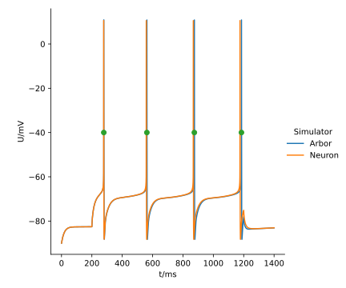

.. _tutorialsinglecellallen:

A single cell model from the Allen Brain Atlas
==============================================

In this tutorial we'll see how we can take a model from the `Allen Brain Atlas <https://brain-map.org/>`_
and run it with Arbor.

.. Note::

   **Concepts covered in this example:**

   1. Take a model from the Allen Brain Atlas.
   2. Load a morphology from an ``swc`` file.
   3. Load a parameter fit file and apply it to a :class:`arbor.decor`.
   4. Building a :class:`arbor.cable_cell` representative of the cell in the model.
   5. Building a :class:`arbor.recipe` reflective of the cell stimulation in the model.
   6. Running a simulation and visualising the results.

Obtaining the model
-------------------

We need a model for which morphological data is available. We'll take
`a cell from the mouse's visual cortex <https://celltypes.brain-map.org/experiment/electrophysiology/488683425>`_.
As the ``README`` in the "Biophysical - all active" model (zip) file explains, the data set is created for use with the Allen SDK and the
Neuron simulator. Instructions about running the model with the
Allen SDK and Neuron `can be found here <https://allensdk.readthedocs.io/en/latest/biophysical_models.html>`_.
For your convenience, this tutorial comes with a reference trace pre-generated.

In the "Biophysical - all active" model (zip) file you'll find:

* a directory with mechanisms (modfiles). For your convenience, Arbor already comes with the
  :func:`arbor.allen_catalogue`, containing mechanisms used by the Allen Brain Atlas.
* an ``swc`` file describing the morphology of the cell.
* ``fit_parameters.json`` describing a set of optimized mechanism parameters. This information will need to be
  loaded into the Arbor simulation.

We will replicate the "Sweep 35" experiment, which applies a current of 150 nA for a duration of 1 s.

The morphology
--------------

.. literalinclude:: ../../python/example/single_cell_allen.py
   :language: python
   :dedent:
   :lines: 74-80

Step **(1)** loads the ``swc`` file using :func:`arbor.load_swc_neuron`. Since the ``swc`` specification is informal, a few different interpretations exist, and we use the appropriate one. The interpretations are described :ref:`here <formatswc-arbor>`.

Step **(2)** sets the labels to the defaults of the ``swc``
`specification <http://www.neuronland.org/NLMorphologyConverter/MorphologyFormats/SWC/Spec.html>`_,
plus a label for the midpoint of the soma. (You can verify in the ``swc`` file, the first branch is the soma.)

The parameter fit
-----------------

The most complicated part is transferring the values for the appropriate parameters in parameter fit file to an
:class:`arbor.decor`. The file file is a ``json`` file, which is fortunate; Python comes with a ``json`` package
in its standard library. The `passive` and `conditions` block contains cell-wide defaults, while the `genome`
section contains the parameters for all the mechanism properties. In certain cases, parameters names include the
mechanism name, so some processing needs to take place.

Step **(3)** shows the precise steps needed to load the fit parameter file into a list of global properties,
region specific properties, reversal potentials, and mechanism parameters. This is not a generic function that will successfully load any Allen model, but it can be used as a starting point. The function composes 4 components out of the ``json`` file:

1. global electro-physiological parameters,
2. a set of electro-physiological parameters per region,
3. a set of reversal potentials per ion species and region,
4. a set of mechanisms with parameters per region.

.. literalinclude:: ../../python/example/single_cell_allen.py
   :language: python
   :dedent:
   :lines: 12-72,82,83

The decor
---------

With the ingredients for the :class:`arbor.decor` extracted, we continue with the function that will return the cable cell from the model as an :class:`arbor.cable_cell`.

.. literalinclude:: ../../python/example/single_cell_allen.py
   :language: python
   :dedent:
   :lines: 85-117

Step **(4)** creates an empty :class:`arbor.decor`.

Step **(5)** assigns global (cell-wide) properties using :func:`arbor.decor.set_property`. In addition, initial
internal and external calcium concentrations are set, and configured to be determined by the Nernst equation.

.. note::
    Setting the calcium reversal potential to be determined by the Nernst equation has to be done manually, in order to mirror
    `an implicit Neuron behavior <https://neuron.yale.edu/neuron/static/new_doc/modelspec/programmatic/ions.html>`_,
    for which the fit parameters were obtained. This behavior can be stated as the following rule:

    If the internal or external concentration of an ion is written, and its reversal potential is read but not
    written, then the Nernst equation is used continuously during the simulation to update the reversal potential of
    the ion according to the Nernst equation

Step **(6)** overrides the global properties for all *regions* for which the fit parameters file specifies adapted
values. Regional properties are :func:`painted <arbor.decor.paint>`, and are painted over (e.g. replacing) the defaults.

Step **(7)** sets the regional reversal potentials.

Step **(8)** assigns the regional mechanisms.

Now that the electro-physiology is all set up, let's move on to the experimental setup.

Step **(9)** configures the :class:`stimulus <arbor.iclamp>` of 150 nA for a duration of 1 s, starting after 200 ms
of the start of the simulation. We'll also install a :class:`arbor.threshold_detector` that triggers at -40 mV. (The
location is usually the soma, as is confirmed by coordinates found in the experimental dataset at
``488683423.nwb/general/intracellular_ephys/Electrode 1/location``)

Step **(10)** specifies a maximum :term:`control volume` length of 20 μm.

Step **(11)** returns the :class:`arbor.cable_cell`.

The model
---------

.. literalinclude:: ../../python/example/single_cell_allen.py
   :language: python
   :dedent:
   :lines: 120-131

Step **(12)** instantiates the :class:`arbor.cable_cell` and an :class:`arbor.single_cell_model`.

Step **(13)** shows how to install a probe to the ``"midpoint"``, with a sampling frequency of 200 kHz.

Step **(14)** installs the :class:`arbor.allen_catalogue`, thereby making its mechanisms available to the definitions added to the decor.

Step **(15)** starts the simulation for a duration of 1.4 s and a timestep of 5 ms.

The result
----------

Let's look at the result! In step **(16)** we first load the reference generated with Neuron and the AllenSDK.
Then, we extract Arbor's output, accessible after the simulation ran at
:class:`arbor.single_cell_model.traces`. Then, we plot them, together with the :class:`arbor.single_cell_model.spikes` in step **(17)**.

.. literalinclude:: ../../python/example/single_cell_allen.py
   :language: python
   :dedent:
   :lines: 133-

    Plot of experiment 35 of the Allen model, compared to the reference generated by the AllenSDK. In green: the threshold detector output; in shaded grey: the stimulus.

.. note::

  The careful observer notices that this trace does not match the experimental data shown on the Allen website
  (or in the ``488683423.nwb`` file). Sweep 35 clearly has 5 spikes, not 4. That is because in the Allen SDK,
  the axon in the ``swc`` file is replaced with a stub, see
  `here <https://www.biorxiv.org/content/10.1101/2020.04.09.030239v1.full>`_ and `here <https://github.com/AllenInstitute/AllenSDK/issues/1683>`_.
  However, that adapted morphology is not exportable back to a modified ``swc`` file. When we tried to mimic
  the procedure, we did not obtain the experimental trace.

  Therefore, we used the unmodified morphology in Arbor *and* the Neuron reference (by commenting out the
  changes the Allen SDK makes to the morphology) in order to make a 1:1 comparison possible.

The full code
-------------

You can find the source code for this example in full at ``python/examples/single_cell_allen.py``.
