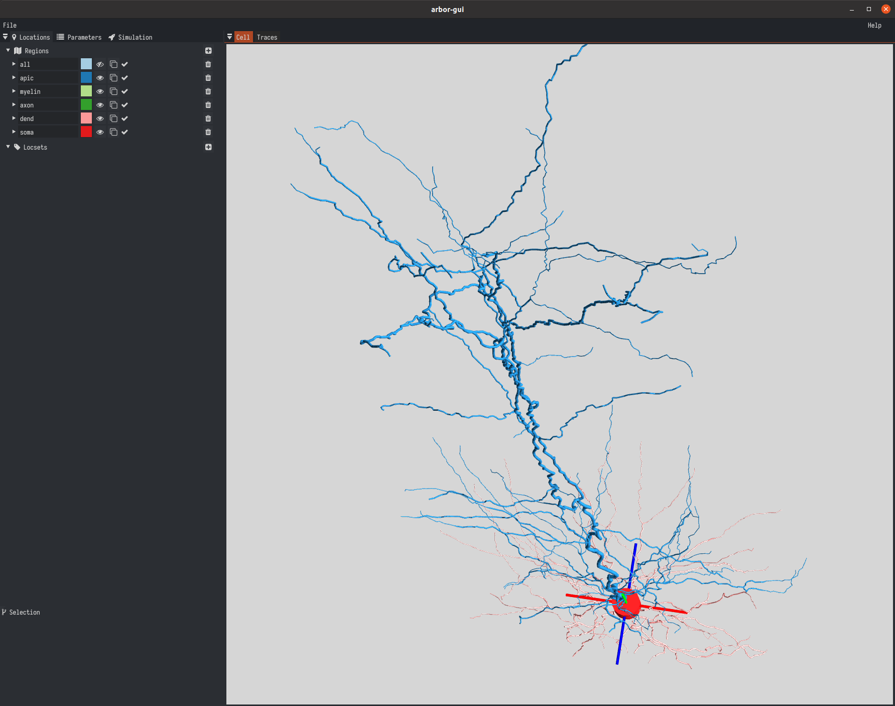
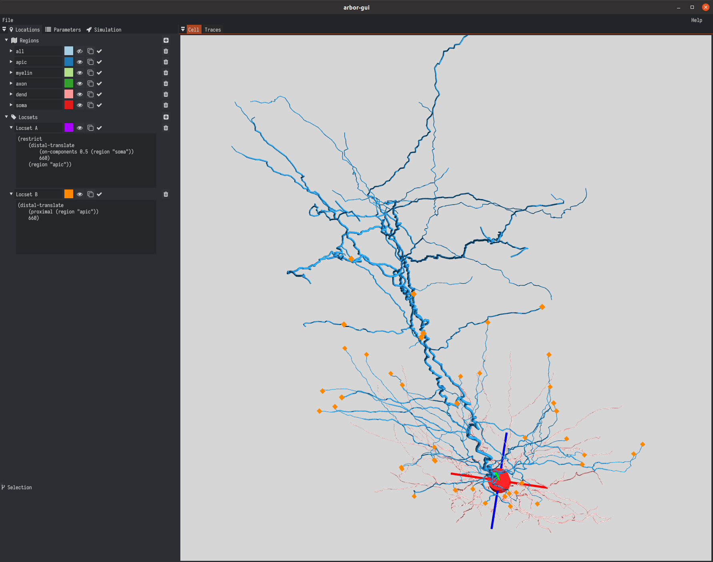
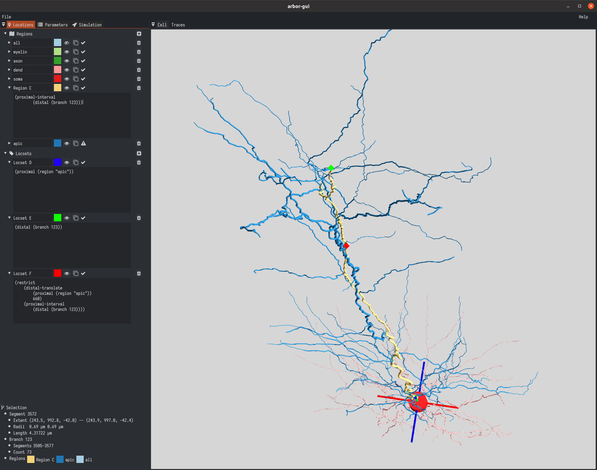
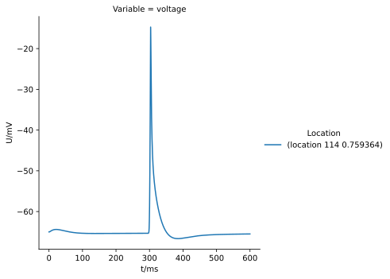
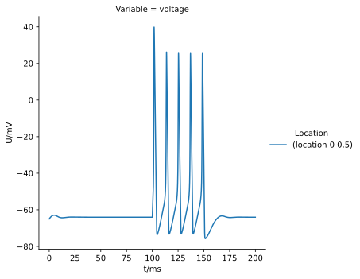

.. _tutorialsinglecellbluepyopt:

A single cell model from the BluePyOpt Cell Optimisation Library
================================================================

In this tutorial we'll see how we can export a model with optimised cell parameters from the `BluePyOpt package <https://github.com/BlueBrain/BluePyOpt>`_. In the process, we will learn to edit the morphology in order to replace the axon with a surrogate model and use the Arbor GUI to define stimuli and probe locations that are consistent with BluePyOpt protocols for the Neuron simulator.

.. Note::

   **Concepts covered in this example:**

   1. Export a model with optimised parameters from BluePyOpt to a mixed JSON/ACC format.
   2. Load the morphology, label dictionary and decor from the mixed JSON/ACC format in Arbor.
   3. Perform axon replacement with a surrogate model using the segment tree editing functionality.
   4. Determine voltage probe locations that match BluePyOpt protocols defined with the Neuron simulator using the Arbor graphical user interface (GUI).
   5. Create an :class:`arbor.cable_cell` and an :class:`arbor.single_cell_model` or :class:`arbor.recipe` supporting mechanism catalogues that are consistent with BluePyOpt. 
   6. Running a simulation and visualising the results.

The model
---------

We will focus on the neocortical layer-5 pyramidal cell from the BluePyOpt repository documented in the `L5PC Jupyter notebook <https://github.com/BlueBrain/BluePyOpt/blob/master/examples/l5pc/L5PC.ipynb>`_ and the references listed thereunder, in particular the `BluePyOpt paper (2015) in Frontiers of Neuroinformatics <https://www.frontiersin.org/articles/10.3389/fninf.2016.00017/full>`_. The steps shown in the following can also be performed on BluePyOpt's `simple-cell example <https://github.com/BlueBrain/BluePyOpt/blob/master/examples/simplecell/simplecell.ipynb>`_ for a more basic setup.

The layer-5 pyramidal cell model is specified with the `morphology <https://github.com/BlueBrain/BluePyOpt/tree/master/examples/l5pc/morphology>`_ in ASC-format, the `mechanisms <https://github.com/BlueBrain/BluePyOpt/tree/master/examples/l5pc/mechanisms>`_, which match Arbor's Blue Brain Project catalogue, and their mapping to morphological regions in `mechanisms.json <https://github.com/BlueBrain/BluePyOpt/blob/master/examples/l5pc/config/mechanisms.json>`_ as well as mechanism parameters in `parameters.json <https://github.com/BlueBrain/BluePyOpt/blob/master/examples/l5pc/config/parameters.json>`_. The model exclusively uses density mechanisms. However, models with point-processes can also be exported to the JSON/ACC format presented in this tutorial.

Export to JSON/ACC
------------------

Before we can export a model, we first have to create it inside BluePyOpt. This can be achieved from the `l5pc directory <https://github.com/BlueBrain/BluePyOpt/blob/master/examples/l5pc>`_ by running

.. code-block:: python

   from bluepyopt import ephys
   import l5pc_model

   cell_model = ephys.models.CellModel(
      'l5pc',
      morph=ephys.morphologies.NrnFileMorphology('morphology/C060114A7.asc',
                                                 do_replace_axon=False),
      mechs=l5pc_model.define_mechanisms(),
      params=l5pc_model.define_parameters())

For the optimised parameters, we will use those published by Markram et al. "Reconstruction and simulation of neocortical microcircuitry." Cell 163.2 (2015): 456-492, as cited in the `L5PC notebook <https://github.com/BlueBrain/BluePyOpt/blob/master/examples/l5pc/L5PC.ipynb>`_.

.. code-block:: python

   param_values = {
      "gNaTs2_tbar_NaTs2_t.apical": 0.026145,
      "gSKv3_1bar_SKv3_1.apical": 0.004226,
      "gImbar_Im.apical": 0.000143,
      "gNaTa_tbar_NaTa_t.axonal": 3.137968,
      "gK_Tstbar_K_Tst.axonal": 0.089259,
      "gamma_CaDynamics_E2.axonal": 0.002910,
      "gNap_Et2bar_Nap_Et2.axonal": 0.006827,
      "gSK_E2bar_SK_E2.axonal": 0.007104,
      "gCa_HVAbar_Ca_HVA.axonal": 0.000990,
      "gK_Pstbar_K_Pst.axonal": 0.973538,
      "gSKv3_1bar_SKv3_1.axonal": 1.021945,
      "decay_CaDynamics_E2.axonal": 287.198731,
      "gCa_LVAstbar_Ca_LVAst.axonal": 0.008752,
      "gamma_CaDynamics_E2.somatic": 0.000609,
      "gSKv3_1bar_SKv3_1.somatic": 0.303472,
      "gSK_E2bar_SK_E2.somatic": 0.008407,
      "gCa_HVAbar_Ca_HVA.somatic": 0.000994,
      "gNaTs2_tbar_NaTs2_t.somatic": 0.983955,
      "decay_CaDynamics_E2.somatic": 210.485284,
      "gCa_LVAstbar_Ca_LVAst.somatic": 0.000333
   }

We can now export the model to a given target directory using the ``create_acc`` module in BluePyOpt.

.. code-block:: python

   ephys.create_acc.output_acc('path/to/exported/l5pc', cell_model, param_values)

This exports a model in a mixed JSON/ACC format analogous to that in the example directory of Arbor at ``python/example/single_cell_bluepyopt/l5pc``. The whole set of steps to construct and export the model is automated in the script `generate_acc.py <https://github.com/BlueBrain/BluePyOpt/blob/master/examples/l5pc/generate_acc.py>`_, part of BluePyOpt.

This script also supports axon replacement by first instantiating the morphology in BluePyOpt through the Neuron simulator before exporting the model to JSON/ACC with:

.. code-block:: python

   nrn_sim = ephys.simulators.NrnSimulator()
   cell_model.instantiate_morphology_3d(nrn_sim)

The model in the example directory ``python/example/single_cell_bluepyopt/l5pc`` was exported using this setting. For this reason, we find an axon-replacement morphology and a modified morphology (after performing axon replacement on the original) in the ACC format in that directory. The latter can be obtained by setting ``create_mod_morph=True`` as a parameter to ``create_acc``. For a more basic example, consider ``python/example/single_cell_bluepyopt/simplecell``, where no axon replacement is performed and, hence, only the original morphology is exported.

Load from JSON/ACC
------------------

The exported model is summarised by a JSON file in the output directory, that references the original morphology file (for the layer-5 pyramical cell in ASC, for the simple-cell in SWC), a label dictionary and decor (both in ACC) with relative paths. For the simple-cell example, this amounts to

.. literalinclude:: ../../python/example/single_cell_bluepyopt/simplecell/simple_cell.json
   :language: json
   :dedent:

In case of axon replacement, the morphology to replace the axon with (``replace_axon``) and (optionally) the morphology resulting after performing axon-replacement on the original (``modified``) are also exported in the ACC format, as in the layer-5 pyramidal cell example.

.. literalinclude:: ../../python/example/single_cell_bluepyopt/l5pc/l5pc.json
   :language: json
   :dedent:
   :lines: 4-8

We use a file-format specific loader for the morphology (e.g. :py:func:`~arbor.load_asc`), while the label-dict and decor can be loaded as Arbor cable cell components (:py:func:`~arbor.load_component`). So, for the exported ``l5pc`` example in the Arbor repository, we can set:

.. code-block:: python

   cell_json_filename = 'python/example/single_cell_bluepyopt/l5pc/l5pc.json'

and use

.. code-block:: python

   with open(cell_json_filename) as f:
       cell_json = json.load(f)
   morpho = arbor.load_asc(cell_json['morphology']['original'])
   labels = arbor.load_component(cell_json['label_dict']).component
   decor = arbor.load_component(cell_json['decor']).component

This loads the original morphology. For the exported simple-cell, this represents the morphology used inside BluePyOpt. On the other hand, for the exported layer-5 pyramidal cell the modifications in terms of axon replacement still have to be applied. We will turn to that topic in the following.

In BluePyOpt, the above steps can be abbreviated using the ``read_acc`` function. This also reconstructs the morphology in a way that is faithful to BluePyOpt's Neuron-based axon replacement procedure. 

.. literalinclude:: ../../python/example/single_cell_bluepyopt_l5pc.py
   :language: python
   :dedent:
   :lines: 20

Axon replacement
----------------

A common modeling choice for cell optimisation with the Neuron simulator in BluePyOpt is to substitute the axon by a simpler surrogate morphology that is computationally cheaper to simulate. `The assumption is that the axon is often not modeled well or at all, and its function is poorly understood <https://www.nature.com/articles/s41467-017-02718-3>`_.

The corresponding composite morphology can be obtained in Arbor by substituting the axon of the original morphology (``original``) with the exported replacement (``replace_axon``) using the segment tree editing primitives :func:`arbor.segment_tree.split_at` and :func:`arbor.segment_tree.join_at`. The axon-replacement morphology is automatically exported to ACC when calling ``create_acc`` on a cell model with a morphology that has ``do_replace_axon`` set to ``True``. If the axon-replacement exported by BluePyOpt is not satisfactory, alternatively, the user can also define his/her own morphology in ACC to use as a replacement.

To perform axon replacement, we first have to find the (unique) root segment of this region in the morphology. We can then split the segment tree at the axon root into two separate segment trees - a pruned one and one for the original axon.

.. code-block:: python

   # get unique axon root (tag for axon is 2)
   axon_root = morpho.segment_tree.tag_roots(2)[0]

   # prune morphology at axon root
   pruned_st, axon_st = morpho.segment_tree.split_at(axon_root)

Then we can determine the parent of the axon root to join the replacement onto, which we load from ACC. Alternatively, the user can build/supply a custom replacement here.

.. code-block:: python

   # parent segment to join onto
   axon_parent = morpho.segment_tree.parents[axon_root]

   # load replacement morphology
   axon_replacement = arbor.load_component(
      cell_json['morphology']['replace_axon']).component
   axon_replacement_st = replacement.to_segment_tree()

   # pruned segment tree with axon replacement
   joined_st = pruned_st.join_at(
      axon_parent, axon_replacement_st)

   # final morphology
   morpho_axon_replaced = arbor.morphology(joined_st)

The steps presented here are performed automatically when loading an exported model with the above ``read_acc`` function from BluePyOpt.

Define locations in the GUI
---------------------------

BluePyOpt makes use of the Neuron simulator's features to define custom locations for stimuli and voltage probes that can be challenging to translate to Arbor. As an example, the layer-5 pyramidal cell optimisation problem has a protocol named ``bAP`` with multiple voltage probes located distally on the apical dendrite at a fixed distance from the soma as described in `config/protocols.json <https://github.com/BlueBrain/BluePyOpt/blob/master/examples/l5pc/config/protocols.json>`_.

To describe these locations accurately in Arbor, we will use the Arbor GUI. For this purpose, we create an :class:`arbor.cable_cell` and export it to ACC so that it can be loaded in the GUI,

.. code-block:: python

   cell = arbor.cable_cell(morpho, decor, labels)
   arbor.write_component(cell, 'path/to/l5pc_cable_cell.acc')

After loading this file in the GUI with ``File > Cable cell > Load``, we can click the ``Locations`` and ``Cell`` tab to obtain the following overview.

    Apical view on the layer-5 pyramidal cell morphology with axon-replacement performed. The replacement axon is not visible from this perspective as hidden by the soma (red). Colour legend for regions on the left. 

The first extra recording of the ``bAP`` protocol is located at 660 µm from the soma. As a first attempt to formulate this location using Arbor's S-expression syntax for :ref:`regions <labels-region-expr>` and :ref:`locsets <labels-locset-expr>`, we can use

.. code-block::

   (distal-translate (on-components 0.5 (region "soma")) 660)

and since we're only interested in the apical dendrite, we can wrap this in ``(restrict ... (region "apic"))``.

Unfortunately, for this particular morphology, this does not result in a concrete location as can be seen in the Arbor GUI below (Locset A, violet, is empty). Alternatively, the method :func:`arbor.cable_cell.locations` will also return an empty list of concrete locations for this expression. To obtain a valid location instead, we can replace ``(on-components 0.5 (region "soma"))`` by the proximal boundary of the apical dendrite with ``(proximal (region "apic"))`` (Locset B, orange). The restrict operation to the apical region is no longer necessary. But now, the resulting concrete location is non-unique.

    First two attempts (Locset A and B) to define a location for the extra recording in the ``bAP`` protocol on the layer-5 pyramidal cell morphology with axon-replacement.

BluePyOpt solves this issue with the Neuron simulator by choosing a particular section on the apical dendrite. While a similar approach is possible in Arbor using the :func:`arbor.cable_cell.locations` method, for reproducibility it is preferable to determine the location directly oneself as a user in the Arbor GUI.

For this purpose, we can identify a particular branch (or segment) by hovering over the distal apical part of the morphology with the mouse and keeping a focus on the data in the left lower corner. We can then define a region with 

.. code-block::

   (proximal-interval (distal (branch <branch-id>)))
 
that includes the path (Region C, yellow) from that branch to the (apical) root (Locset D, blue). Restricting the above ``distal-translate``-set of locations to this region evaluates to a unique concrete location for the probe (Locset F, red). 

    Proximal region of a distal apical branch (Region C, between Locset D and E) and locset at fixed distance from the apical root for the extra recording in the ``bAP`` protocol on the layer-5 pyramidal cell morphology with axon-replacement.

The final expression for the probe location on the morphology with axon-replacement, hence, is

.. code-block::

   (restrict
      (distal-translate
         (proximal (region "apic"))
         660)
      (proximal-interval
         (distal (branch 123))))

For the following, we will add a label for this location as well as for the center of the soma to the label dictionary.

.. literalinclude:: ../../python/example/single_cell_bluepyopt_l5pc.py
   :language: python
   :dedent:
   :lines: 13,24-28

The cable cell and protocols
----------------------------

Following BluePyOpt's layer-5 pyramidal cell example, we have to define protocols with stimuli and probes as well as make the appropriate mechanism catalogues available to the recipe.

To replicate the ``bAP`` protocol in BluePyOpt, we add a short stimulus centrally at the soma to the decor.

.. literalinclude:: ../../python/example/single_cell_bluepyopt_l5pc.py
   :language: python
   :dedent:
   :lines: 30,32-34,38-40

The decor allows to further customise the discretisation for a subsequent simulation using :func:`arbor.decor.discretisation` as done in the :ref:`tutorial for a detailed single cell model <tutorialsinglecellswc>`. For brevity, we will use the default here except on the soma. As a next step, we create an :class:`arbor.cable_cell` using the morphology, label dictionary and decor.

.. literalinclude:: ../../python/example/single_cell_bluepyopt_l5pc.py
   :language: python
   :dedent:
   :lines: 42,44

Then, we can install a voltage probe on the apical dendrite.

.. literalinclude:: ../../python/example/single_cell_bluepyopt_l5pc.py
   :language: python
   :dedent:
   :lines: 46,48

To prepare the cable cell for simulation, we can either construct an instance of the :class:`arbor.single_cell_model` from the cable cell (shown in the simple-cell example) or - for more complicated use cases - define our own recipe. We will follow the latter for the layer-5 pyramidal cell. 

To be runnable in a simulation, we also need to make sure the appropriate mechanism catalogues are loaded. For the layer-5 pyramidal cell example, all used mechanisms are built into arbor's :func:`arbor.bbp_catalogue`. For the simple-cell example, they are built into the :func:`arbor.default_catalogue`. Therefore, the following lines defining the recipe's global properties will suffice to run these examples. Note that we are using explicit prefix qualifiers - this is required by BluePyOpt's JSON/ACC exporter.

.. literalinclude:: ../../python/example/single_cell_bluepyopt_l5pc.py
   :language: python
   :dedent:
   :lines: 51-92

If we want to run a model with mechanism catalogues that are not built into Arbor, we can specify a mapping of catalogue name to folder with the NMODL files in the argument ``ext_catalogues`` of the JSON/ACC exporter. We can then load the catalogue with an appropriate prefix analogous to the built-in ones using ``arbor.load_catalogue('<name>-catalogue.so', '<name>::')`` and use it with the exported model. Here, ``<name>-catalogue.so`` is the compiled output of ``arbor-build-catalogue <name> <path/to/nmodl>``. To use such a mechanism catalogue in a BluePyOpt optimisation, ``<name>-catalogue.so`` must be available in the same folder as the NMODL files at runtime. It is then sufficient, to supply the same ``ext_catalogues`` dictionary as used in the JSON/ACC exporter to the ``ephys.simulators.ArbSimulator`` at its construction.

Running the simulation
----------------------

We can now run a simulation with

.. literalinclude:: ../../python/example/single_cell_bluepyopt_l5pc.py
   :language: python
   :dedent:
   :lines: 94-96,100-104

and visualise the voltage trace for the measurement on the apical dendrite of the layer-5 pyramidal cell that is available through ``sim.samples(handle)``. 

For the simple-cell, we obtain the following voltage trace using the ``step2`` protocol from the `Jupyter notebook <https://github.com/BlueBrain/BluePyOpt/blob/master/examples/simplecell/simplecell.ipynb>`_

The full code
-------------

You can find the source code for this example in full at ``python/examples/single_cell_bluepyopt_l5pc.py`` and ``python/examples/single_cell_bluepyopt_simplecell.py``.
