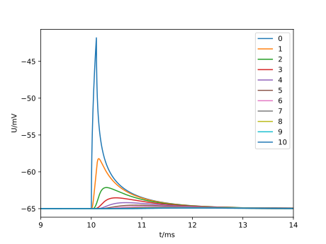
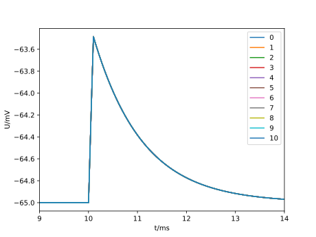

.. _tutorialsinglecellcable:

A simple dendrite
==============================

In this example, we will set up a single dendrite represented by a passive cable.
On one end the dendrite is stimulated by a short current pulse.
We will investigate how this pulse travels along the dendrite and calculate the conduction velocity.

.. Note::

   **Concepts covered in this example:**

   1. Creating a simulation recipe of a single dendrite.
   2. Placing probes on the morphology.
   3. Running the simulation and extracting the results.
   4. Investigating the influence of control volume policies.

The full code
*************

You can find the full code of the example at ``python/examples/single_cell_cable.py``

Executing the script will run the simulation with default parameters.

Walk-through
************

We set up a recipe for the simulation of a single dendrite with some parameters.

.. literalinclude:: ../../python/example/single_cell_cable.py
   :language: python
   :lines: 11-75

Implementing the ``cell_description`` member function constructs the morphology and sets the properties of the dendrite as well as the current stimulus and the discretization policy.

.. literalinclude:: ../../python/example/single_cell_cable.py
   :language: python
   :lines: 77-113

We parse the command line arguments, instantiate the recipe, run the simulation, extract results and plot:

.. literalinclude:: ../../python/example/single_cell_cable.py
   :language: python
   :lines: 153-229

The output plot below shows how the current pulse is attenuated and
gets broader the further it travels along the dendrite from the current
clamp.

The conduction velocity in simulation is calculated from the time of the maximum of the membrane potential.

.. literalinclude:: ../../python/example/single_cell_cable.py
   :language: python
   :lines: 231-

Keep in mind that the calculated (idealized) conduction velocity is only correct for an infinite cable.

::

	calculated conduction velocity: 0.47 m/s
	simulated conduction velocity:  0.50 m/s

When we set the control volume policy to cover the full dendrite, all probes will see the same voltage.

.. code-block:: bash

	./single_cell_cable.py --length 1000 --cv_policy_max_extent 1000

Output:

