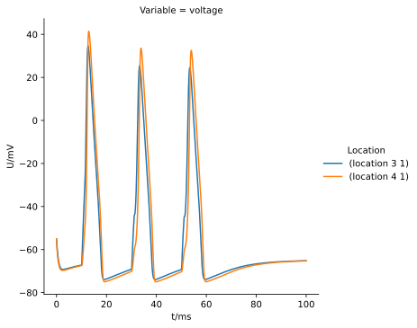

.. _tutorialsinglecellswcrecipe:

A detailed single cell recipe
=============================

This example builds the same single cell model as :ref:`tutorialsinglecellswc`,
except using a :class:`arbor.recipe` and :class:`arbor.simulation` instead of a :class:`arbor.single_cell_model`.

This time, we'll learn a bit more about setting up advanced features using a :class:`arbor.recipe`.

.. Note::

   **Concepts covered in this example:**

   1. Building a :class:`arbor.recipe`.
   2. Building an :class:`arbor.context`.
   3. Create a :class:`arbor.simulation`.
   4. Running the simulation and visualizing the results,

The cell
********

We can copy the cell description code or reuse ``single_cell_detailed.swc`` from the
:ref:`original example <tutorialsinglecellswc-cell>` where it is explained in detail.

The recipe
**********

The :class:`arbor.single_cell_model` of the original example created a :class:`arbor.recipe` under
the hood, and abstracted away the details so we were unaware of its existence. In this example, we will
examine the recipe in detail: how to create one, and why it is needed.

.. literalinclude:: ../../python/example/single_cell_detailed_recipe.py
   :language: python
   :lines: 74-114

Let's go through the recipe point by point.

Step **(5)** creates a ``single_recipe`` class that inherits from :class:`arbor.recipe`.
:meth:`arbor.recipe.num_cells`, :meth:`arbor.recipe.cell_kind` and :meth:`arbor.recipe.cell_description`
always have to be implemented by the user. We'll also implement :meth:`arbor.recipe.global_properties` to be able
to decorate :class:`arbor.cell_kind.cable` cells with mechanisms and :meth:`arbor.recipe.probes` to be able to
insert the probe.

Step **(5.1)** defines the class constructor. As per :class:`arbor.recipe` instructions, we call
``arbor.recipe.__init__(self)`` to ensure correct initialization of memory in the C++ class.

We then create the ``self.the_props`` variable. This will hold the global properties of the model, which apply
to all the cells in the network. We initialize it with :class:`arbor.cable_global_properties`, which comes with the 
``default`` mechanism catalogue built-in. We set all the properties of the system similar to what we did in
the :ref:`original example <tutorialsinglecellswc-gprop>`. One last important step is to extend ``self.the_props``
to include the Allen catalogue, because it holds the *Ih* mechanism. The *hh* and *pas* mechanisms came with the
default catalogue.

Step **(5.2)** overrides the :meth:`~arbor.recipe.num_cells` method. It takes no arguments. We simply return 1,
as we are only simulating one cell in this example.

Step **(5.3)** overrides the :meth:`~arbor.recipe.cell_kind` method. It takes one argument: ``gid``.
Given the gid, this method returns the kind of the cell. Our defined cell is a
:class:`arbor.cell_kind.cable`, so we simply return that.

Step **(5.4)** overrides the :meth:`~arbor.recipe.cell_description` method. It takes one argument: ``gid``.
Given the gid, this method returns the cell description which is the cell object passed to the constructor
of the recipe. We return ``cell``, the cell created just above.

Step **(5.5)** overrides the :meth:`~arbor.recipe.probes` method. It takes one argument: ``gid``.
Given the gid, this method returns all the probes on the cell. The probes can be of many different kinds
measuring different quantities on different locations of the cell. Like in the original example, we will
create the voltage probe at the ``"custom_terminal"`` locset. This probe was registered directly using the 
:class:`arbor.single_cell_model` object. Now it has to be explicitly created and registered in the recipe.

Step **(5.6)** overrides the :meth:`~arbor.recipe.global_properties` method. It takes one argument: ``kind``.
This method returns the default global properties of the model which apply to all cells in the network of
that kind. We only use ``cable`` cells in this example (but there are more) and thus always return a
``cable_cell_properties`` object. We return ``self.the_props`` which we defined in step **(1)**.

.. Note::

   You may wonder why the method :meth:`arbor.recipe.cell_kind` is required, since it can be inferred by examining the cell description.
   The recipe was designed to allow building simulations efficiently in a distributed system with minimum
   communication. Some parts of the model initialization require only the cell kind,
   not the full cell description which can be quite expensive to build. Providing these
   descriptions separately saves time and resources for the user.

   More information on the recipe can be found :ref:`here <modelrecipe>`.

Now we can instantiate a ``single_recipe`` object.

.. literalinclude:: ../../python/example/single_cell_detailed_recipe.py
   :language: python
   :lines: 113-114

The simulation
**************

We have all we need to create a :class:`arbor.simulation` object.

Before we run the simulation, however, we need to register what results we expect once execution is over.
This was handled by the :class:`arbor.single_cell_model` object in the original example.

.. literalinclude:: ../../python/example/single_cell_detailed_recipe.py
   :language: python
   :lines: 116-123

We would like to get a list of the spikes on the cell during the runtime of the simulation, and we would like
to plot the voltage registered by the probe on the "custom_terminal" locset.

The lines handling probe sampling warrant a second look. First, we declared ``probeset_id`` to be a
:class:`arbor.cell_member`, with :class:`arbor.cell_member.gid` = 0 and :class:`arbor.cell_member.index` = 0.
This variable serves as a global identifier of a probe on a cell, namely the first declared probe on the
cell with ``gid = 0``, which is id of the only probe we created on the only cell in the model.

Next, we instructed the simulation to sample ``probeset_id`` at a frequency of 50 kHz. That function returns a
:term:`handle` which we will use to :ref:`extract the results <pycablecell-probesample>` of the sampling after running the simulation.

We can now run the simulation we just instantiated for a duration of 100 ms with a time step of 0.025 ms.

.. literalinclude:: ../../python/example/single_cell_detailed_recipe.py
   :language: python
   :lines: 125-126

The results
***********

The last step is result collection. We instructed the simulation to record the spikes on the cell, and
to sample the probe.

We can print the times of the spikes:

.. literalinclude:: ../../python/example/single_cell_detailed_recipe.py
   :language: python
   :lines: 128-132

The probe results, again, warrant some more explanation:

.. literalinclude:: ../../python/example/single_cell_detailed_recipe.py
   :language: python
   :lines: 134-138

``sim.samples()`` takes a ``handle`` of the probe we wish to examine. It returns a list
of ``(data, meta)`` terms: ``data`` being the time and value series of the probed quantity; and
``meta`` being the location of the probe. The size of the returned list depends on the number of
discrete locations pointed to by the handle. We placed the probe on the "custom_terminal" locset which is
represented by 2 locations on the morphology. We therefore expect the length of ``sim.samples(handle)``
to be 2.

We plot the results using pandas and seaborn as we did in the original example, and expect the same results:

.. literalinclude:: ../../python/example/single_cell_detailed_recipe.py
   :language: python
   :lines: 140-

The following plot is generated. Identical to the plot of the original example.

The full code
*************

You can find the full code of the example at ``python/examples/single_cell_detailed_recipe.py``.
