.. _tutorialgui:

Single Cell in GUI
==================

Here we will show you how to re-create the :ref:`single segment cell example <tutorialsinglecell>`
in the GUI.

Get the GUI
-----------

Download a pre-built binary from the `GUI releases
page <https://github.com/arbor-sim/gui/releases/>`__.

Start the GUI and you should see a window like this: |image0|

Define a Morphology
-------------------

As we need a morphology that can be loaded from disk for use in the GUI,
we will make a very simple SWC file:

::

   1 1     -3.0     0.0     0.0     3   -1
   2 1      3.0     0.0     0.0     3    1

This sets up a cell consisting of a soma with radius ``3 μm``, extending
``6 μm`` along the x-axis. If you are unfamiliar with SWC, do not worry,
this is all we need to do with it. Store this data as eg ``soma.swc``.

Now we need to load this file. In the GUI:

1. Click on 'File' in the top left: |image1|
2. Choose 'Morphology > Load'
3. Navigate to your file using the dialogue: |image2|
4. Pick your file and click 'Load'

-  If your file is among many others, you can filter for the ``.swc``
   extension only by choosing that suffix in 'Filter'
-  SWC data has multiple interpretations; here we use the 'Neuron'
   flavor

5. Go to the cell tab and take a look at your cell in 3D

-  Mouse wheel and +/- zoom the view
-  Pressing Shift brings up a rotation handle
-  Pressing Ctrl brings up a translation handle
-  Right click the cell tab to

   -  Reset the camera
   -  Manipulate the axes cross
   -  Save a screenshot
   -  Tweak the model rendering resolution, might help performance in
      complex views
   -  Hover segments to learn some details about the geometry

E.g.: |image3| |image4|

Defining Locations
------------------

Now we are ready to continue work on the tutorial by setting up regions
and locsets. On the left pane switch to the 'Locations' and expand the
'Regions' and 'Locset' All regions we need are defined, as we just have
made a simple soma-only cell.

To attach stimuli and probes we will need a location set, or 'locset'.
Click on the '+' right of 'Locsets' to add one.

Type in the following definition in the text box

::

   (location 0 0.5)

Keep track of the status icon changing state from ❔ (empty) over ⚠️
(invalid) to ✔️ (ok) as you type. You can hover your mouse over it to
learn more. |image5|

The locset we just defined designates the center (0.5) of segment 0.
Segment 0 happens to be the soma. We can assign names to locsets to
remember their use or definition. So, change the name from 'Locset 0' to
'midpoint'. When done zoom in on the cell to see a marker at the locset
point(s). |image6|

Note: If you have defined overlapping regions and locsets you can drag
the definitions to reorder them. That will change rendering order
accordingly and allow you to see hidden parts.

Assigning Bio-physical Properties
---------------------------------

We are now done with 'Locations'. Switch to the 'Parameters' tab and
assign ``-40 mV`` under 'Cable Cell Properties' > 'Default' > 'Membrane
Potential'. This set the initial value of the cell's membrane potential.
|image7|

Next, expand the 'Mechanisms' > 'soma' tree and add a mechanism by
clicking the '+' icon on the right and choosing 'hh' under the 'default'
section from the combo box. You can expand this item further to take a
look at the 'hh' mechanism's properties. |image8| With that, the soma
will exhibit Hodgekin-Huxley model behaviour and we are almost ready to
run the model.

Setting up the Simulation
-------------------------

Switch to the 'Simulation' tab. Under 'End time', enter ``20 ms``. Then
expand 'Stimuli' and current clamp to the 'midpoint' locset by clicking
'+' on the right.

Note: if 'midpoint' described more than one point, multiple current
source would be applied. In this case we only have one.

Expand the 'I Clamp 0' item and look for the 'Envelope' section. There,
add a point at 10ms with 0.8nA and another at 12ms going back to 0nA.
The result should look like this:

|image9|

The last step: click on 'Probes' and add a 'Voltage' probe to 'midpoint'
This will allow us to record the membrane potential at the soma's
center.

|image10|

Running Simulations and Getting Outputs
---------------------------------------

Now click 'Run' at the top of the tab. Next switch from 'Cell' to
'Traces' on the right pane. Expand 'midpoint' on the right and select
'0: Voltage'. You should now see this |image11|

Congratulations! This a complete simulation of a simple cell.

Where to go from here
---------------------

You can play with the simulation you just made, but beforehand it might
help to save the current state (except probes). To do that choose 'File' >
'Cable' > 'Save'.

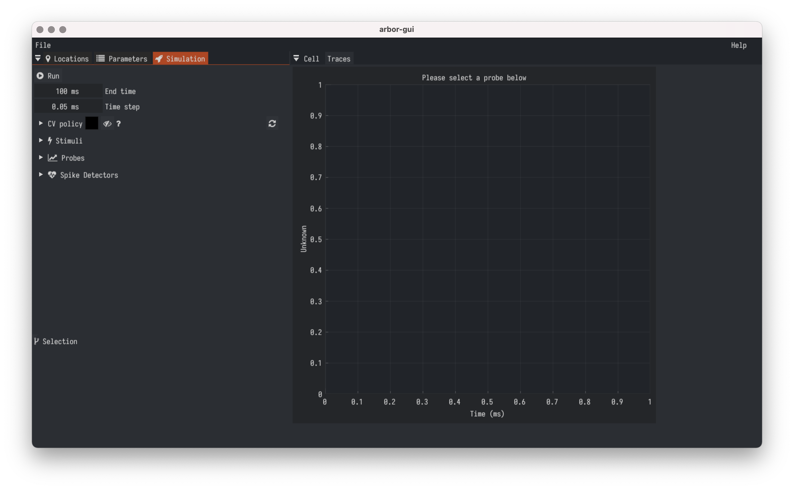
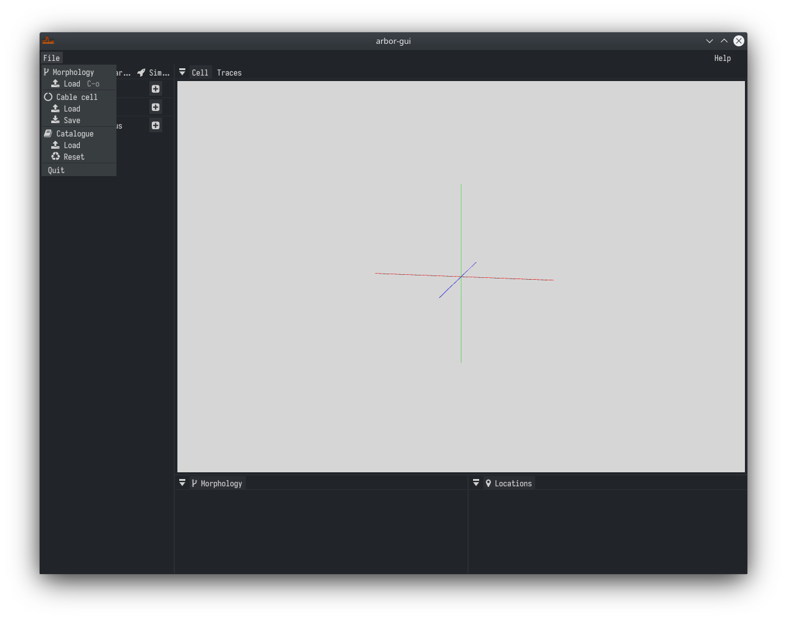
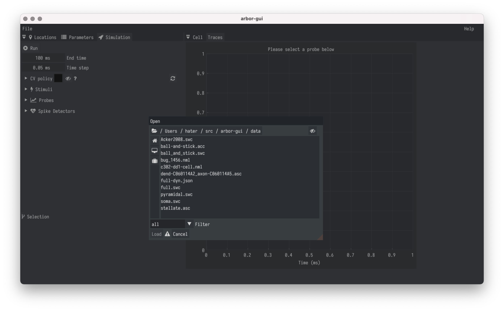
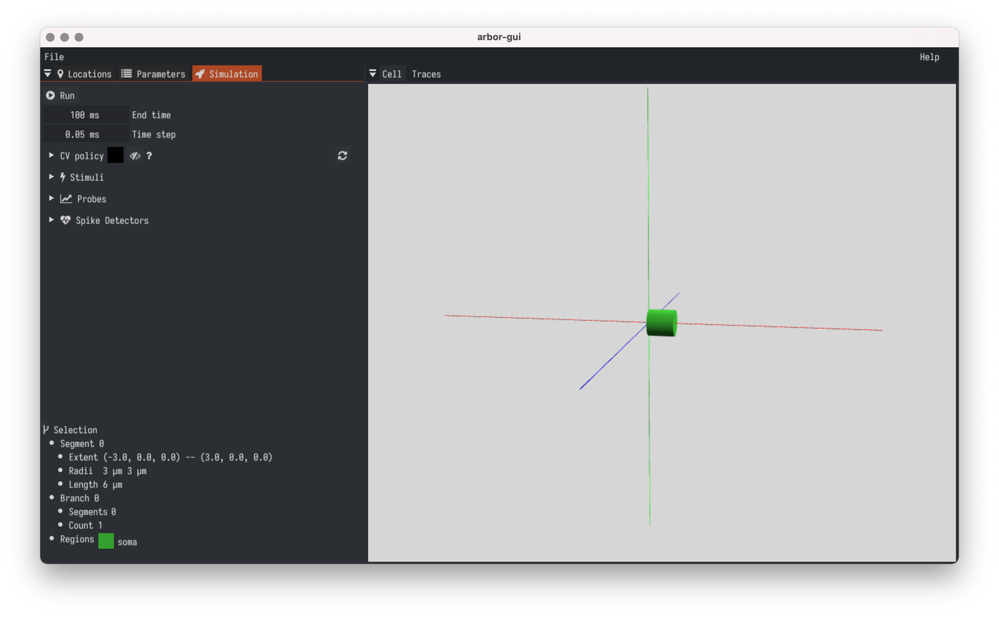
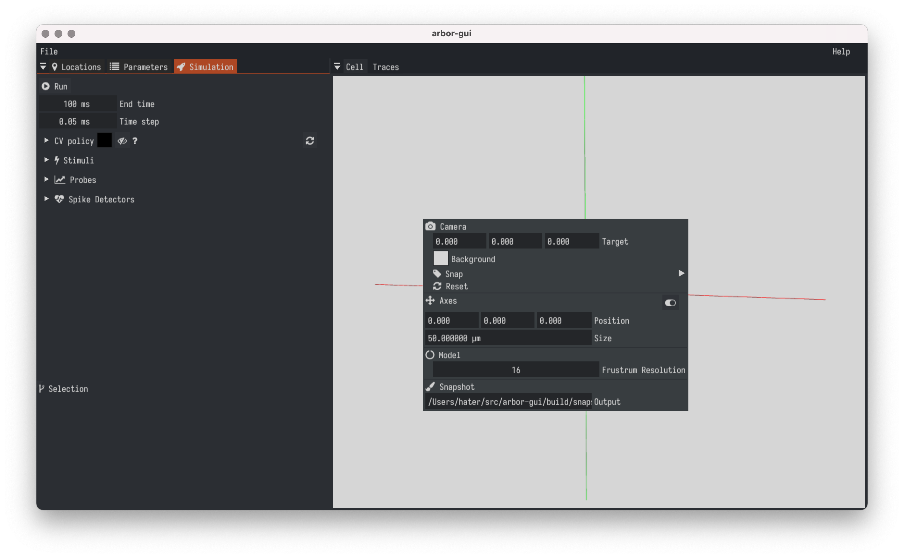
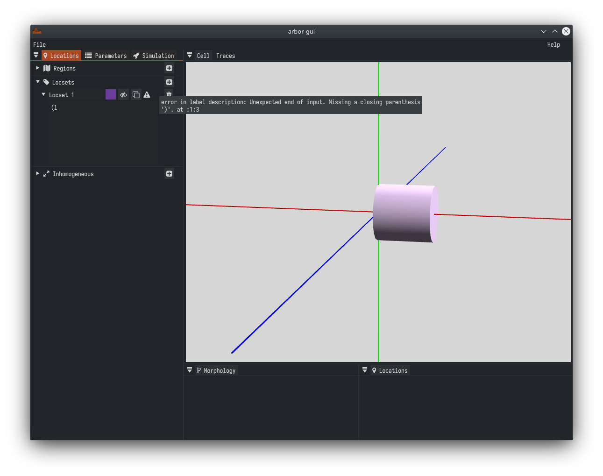
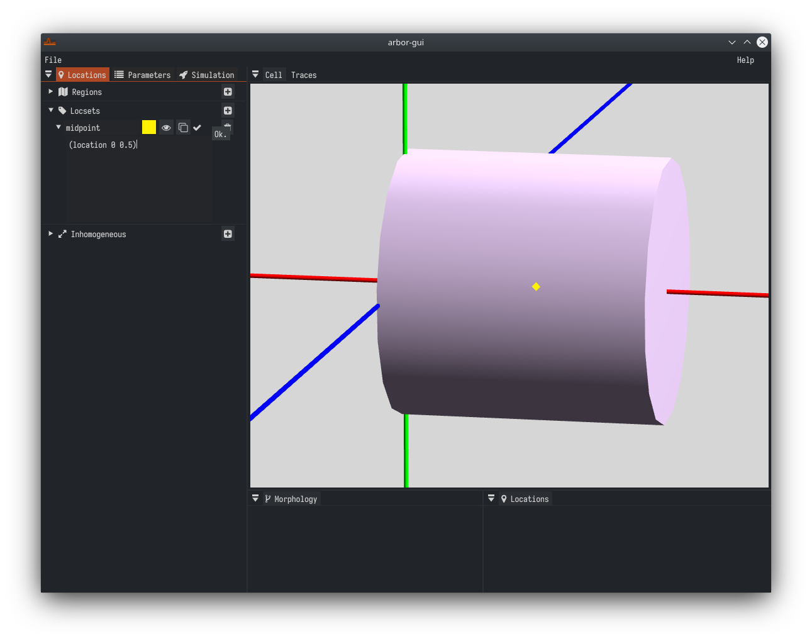
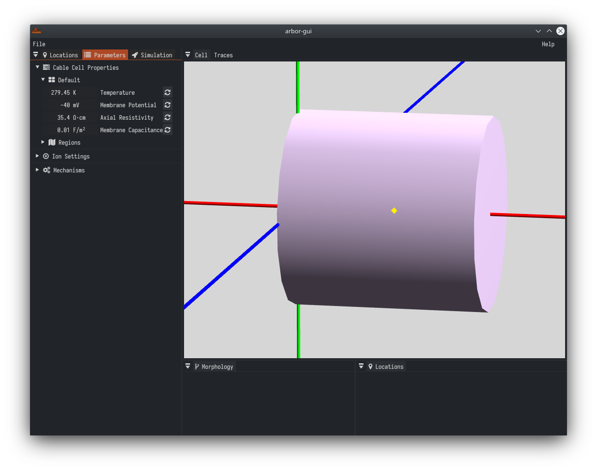
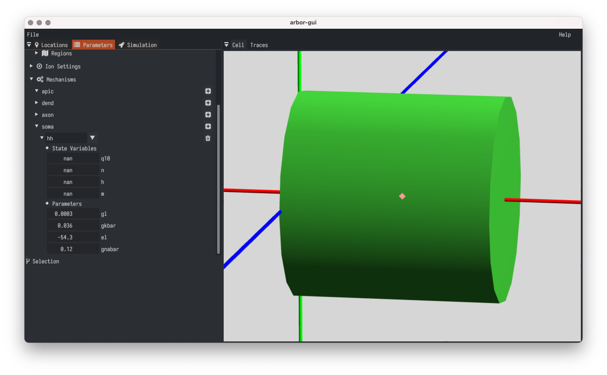
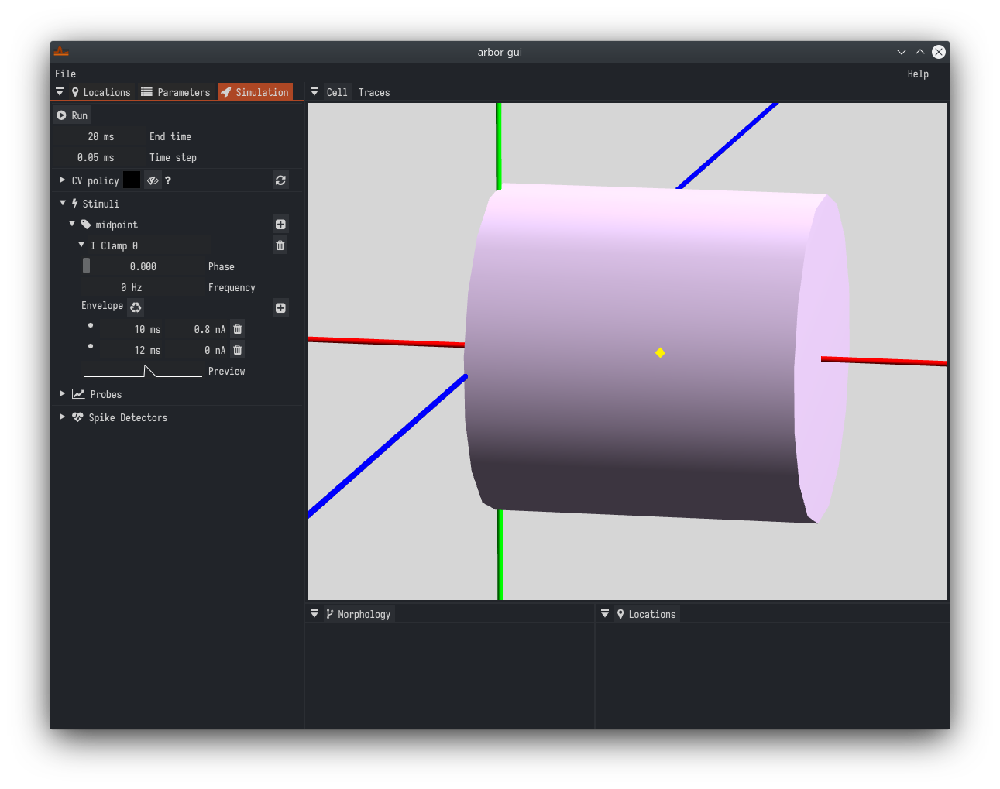
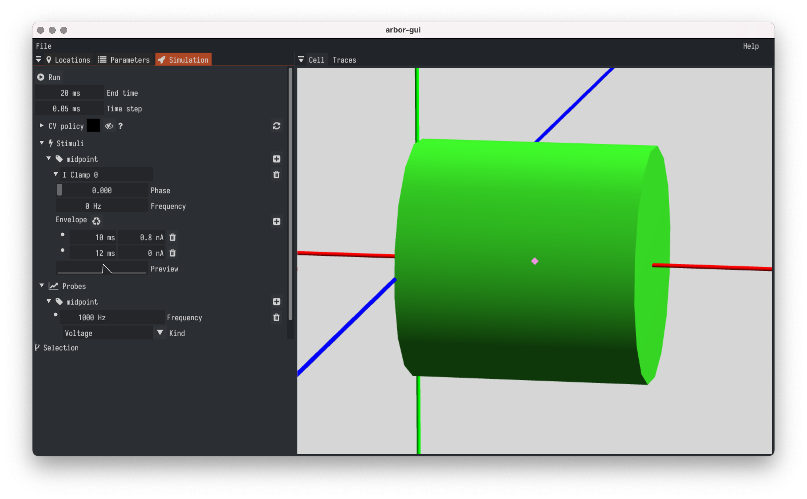
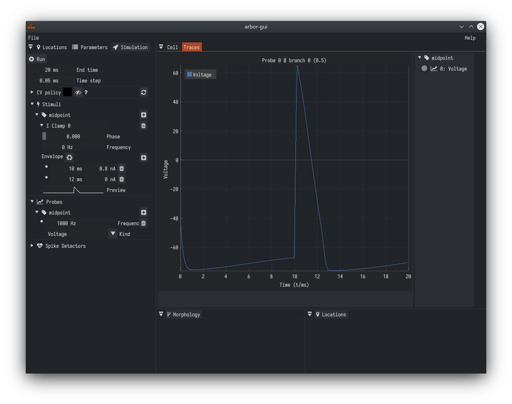
