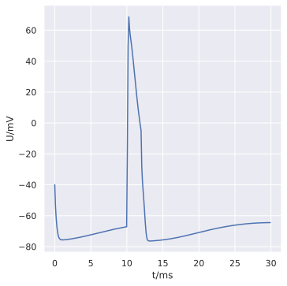

.. _tutorialsinglecellrecipe:

A simple single cell recipe
===========================

This example builds the same single cell model as :ref:`tutorialsinglecell`,
except using a :class:`arbor.recipe` and :class:`arbor.simulation` instead of a :class:`arbor.single_cell_model`.

Recipes are an important concept in Arbor. They represent the most versatile tool
for building a complex network of cells. We will go though this example of a model
of a single cell, before using the recipe to represent more complex networks in
subsequent examples.

.. Note::

   **Concepts covered in this example:**

   1. Building a :class:`arbor.recipe`.
   2. Using the recipe, default context and domain decomposition to create an :class:`arbor.simulation`
   3. Running the simulation and visualizing the results.

The cell
--------

Let's copy the cell description from the :ref:`original example <tutorialsinglecell-cell>`,
where construction of the cell is explained in detail.

.. literalinclude:: ../../python/example/single_cell_recipe.py
   :language: python
   :lines: 4,10-26

The recipe
----------

In the :ref:`original example <tutorialsinglecell-cell>`, the :class:`arbor.single_cell_model` creates
a :class:`arbor.recipe` under the hood, and abstracts away a few details that you may want control over
in more complex simulations. Let's go into those abstractions and create an analogous :class:`arbor.recipe`
manually.

Creating a recipe starts with creating a class that inherits from :class:`arbor.recipe`. There are a number of
methods that *must* be overridden, and a number than *can optionally* be overridden, as explained in the
:class:`arbor.recipe` documentation. Beyond this, it is up to you, the user, to structure your code as you
find convenient.

One of the methods that must be overridden is :meth:`arbor.recipe.num_cells`. It returns `0` by default and 
models without cells are quite boring!

.. literalinclude:: ../../python/example/single_cell_recipe.py
   :language: python
   :lines: 31-61

Step **(4)** describes the recipe that will reflect our single cell model.

Step **(4.1)** defines the class constructor. It can take any shape you need, but it
is important to call base class' constructor. If the overridden methods of the class
need to return an object, it may be a good idea to have the returned object be a
member of the class. With this constructor, we could easily change the cell and probes
of the model, should we want to do so. Here we initialize the cell properties to match
Neuron's defaults using Arbor's built-in :meth:`arbor.neuron_cable_properties` and
extend with Arbor's own :meth:`arbor.default_catalogue`.

Step **(4.2)** defines that this model has one cell.

Step **(4.3)** returns :class:`arbor.cell_kind.cable`, the :class:`arbor.cell_kind`
associated with the cable cell defined above. If you mix multiple cell kinds and
descriptions in one recipe, make sure a particular ``gid`` returns matching cell kinds
and descriptions.

Step **(4.4)** returns the cell description defined earlier. If we
were modelling multiple cells of different kinds, we would need to make sure that the
cell returned by :meth:`arbor.recipe.cell_description` has the same cell kind as
returned by :meth:`arbor.recipe.cell_kind` for every :gen:`gid`.

Step **(4.5)** returns the same probe as in the ``single_cell_model``: a single voltage probe located at "midpoint".

Step **(4.6)** returns the properties that will be applied to all cells of that kind in the model.

More methods can be overridden if your model requires that, see :class:`arbor.recipe` for options.

Now we instantiate the recipe

.. literalinclude:: ../../python/example/single_cell_recipe.py
   :language: python
   :lines: 64-67

The simulation
--------------

:class:`arbor.single_cell_model` does not only take care of the recipe, it also takes
care of defining how the simulation will be run. When you create and use your own
recipe, you can to do this manually, in the form of defining a execution context
and a domain decomposition. Fortunately, the default constructors of
:class:`arbor.context` and :class:`arbor.partition_load_balance` are sufficient for
this model, and is what :class:`arbor.single_cell_model` does under the hood!
In addition, if all you need is the default context and domain decomposition, they can be
left out and the :class:`arbor.simulation` object can be contructed from just the recipe.

The details of manual hardware configuration will be left for another tutorial.

.. literalinclude:: ../../python/example/single_cell_recipe.py
   :language: python
   :lines: 68-79

Step **(6)** instantiates the simulation.

Step **(7)** sets up the probe added in step 5. In the
:class:`arbor.single_cell_model` version of this example, the probe frequency and
simulation duration are the same. Note that the frequency is set with a :class:`arbor.regular_schedule`,
which takes a time and not a frequency. Also note that spike recording must be
switched on. For :ref:`extraction of the probe traces <pycablecell-probesample>` later on, we store a :term:`handle`.

The results
----------------------------------------------------

Apart from creating :class:`arbor.recipe` ourselves, we have changed nothing
about this simulation compared to :ref:`the original tutorial <tutorialsinglecell>`.
If we create the same analysis of the results we therefore expect the same results.

.. literalinclude:: ../../python/example/single_cell_recipe.py
   :language: python
   :lines: 80-

Step **(8)** plots the measured potentials during the runtime of the simulation.
Retrieving the sampled quantities is a little different, these have to be accessed
through the simulation object: :meth:`arbor.simulation.spikes` and :meth:`arbor.simulation.samples`.

We should be seeing something like this:

    Plot of the potential over time for the voltage probe added in step (5).

You can find the source code for this example in full at ``python/examples/single_cell_recipe.py``.
