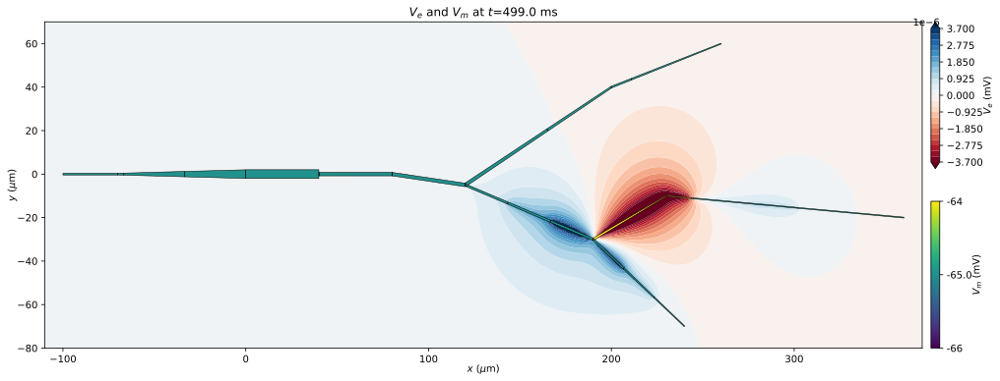

.. _tutorial_lfpykit:

Extracellular signals
=====================

This example takes different elements from the above example tutorials
(:ref:`A simple single cell model <tutorialsinglecell>`,
:ref:`A detailed single cell recipe <tutorialsinglecellswcrecipe>`)
to create a geometrically
complex single cell model from an SWC morphology file, and adds predictions of
extracellular potentials using the external `LFPykit <https://lfpykit.readthedocs.io/en/latest>`_ Python library
(https://LFPykit.readthedocs.io, https://github.com/LFPy/LFPykit).
`LFPykit <https://lfpykit.readthedocs.io/en/latest>`_ provides a few different classes facilitating
calculations of extracellular potentials and related electroencephalography (EEG)
and magnetoencephalography (MEG) signals from geometrically detailed neuron models under various assumptions.
These are signals that mainly stem from transmembrane currents.

This tutorial goes through the required steps in more detail.

In this tutorial, the neuron model itself is kept deliberately simple with only
passive (leaky) membrane dynamics, and it receives sinusoid synaptic current
input in one arbitrary chosen control volume (CV).

.. Note::

   **Concepts covered in this tutorial:**

   1. Building a morphology from an SWC file.
   2. Recording of transmembrane currents using :class:`arbor.cable_probe_total_current_cell`
   3. Recording of stimulus currents using :class:`arbor.cable_probe_stimulus_current_cell`
   4. Calling the :class:`arbor.place_pwlin` API
   5. Map recorded transmembrane currents to extracellular potentials using `LFPykit <https://lfpykit.readthedocs.io/en/latest>`_

.. _tutorial_lfpykit-model:

The single cell model
---------------------

First we import some required modules:

.. literalinclude:: ../../python/example/single_cell_extracellular_potentials.py
   :language: python
   :lines: 16-18

Define ``Recipe`` class:

.. literalinclude:: ../../python/example/single_cell_extracellular_potentials.py
   :language: python
   :lines: 24-56

Load morphology on ``SWC`` file format:

.. code-block:: python

   # define morphology needed for ``arbor.place_pwlin`` and ``arbor.cable_cell`` below
   morphology = arbor.load_swc_arbor('single_cell_detailed.swc')

Define various attributes (:class:`arbor.label_dict`, :class:`arbor.decor`) for
the cell model as well as stimuli (:class:`arbor.iclamp`).
Finally we define discretization policy (:class:`arbor.cv_policy_fixed_per_branch`):

.. literalinclude:: ../../python/example/single_cell_extracellular_potentials.py
   :language: python
   :lines: 70-104

Create :class:`arbor.place_pwlin` instance:

.. literalinclude:: ../../python/example/single_cell_extracellular_potentials.py
   :language: python
   :lines: 107

Define :class:`arbor.cable_cell`, :class:`Recipe`, :class:`arbor.context` etc. and execute model for a few hundred ms,
sampling the different signals every 1 ms:

.. literalinclude:: ../../python/example/single_cell_extracellular_potentials.py
   :language: python
   :lines: 109-127

Extract recorded membrane voltages, electrode and transmembrane currents:

.. literalinclude:: ../../python/example/single_cell_extracellular_potentials.py
   :language: python
   :lines: 129-151

.. _tutorial_lfpykit-lfpykit:

Compute extracellular potentials
--------------------------------

Here we utilize the `LFPykit <https://lfpykit.readthedocs.io/en/latest>`_ library to map
transmembrane currents recorded during the
simulation to extracellular potentials in vicinity to the cell.
We shall account for every segment in each CV using the so-called line-source approximation.

First we define a couple of inherited classes to interface `LFPykit <https://lfpykit.readthedocs.io/en/latest>`_
(as this library is not solely written for Arbor).
Starting with a class inherited from :class:`lfpykit.CellGeometry`
(`lfpykit.CellGeometry <https://lfpykit.readthedocs.io/en/latest/#class-cellgeometry>`_):

.. literalinclude:: ../../python/example/single_cell_extracellular_potentials.py
   :language: python
   :lines: 161-194

Then, a class inherited from :class:`lfpykit.LineSourcePotential`
(`lfpykit.LineSourcePotential <https://lfpykit.readthedocs.io/en/latest/#class-linesourcepotential>`_).
Other use cases may inherit from any other parent class defined in :class:`lfpykit.models`
(`lfpykit.models <https://lfpykit.readthedocs.io/en/latest/#module-lfpykit.models>`_) in a similar manner:

.. literalinclude:: ../../python/example/single_cell_extracellular_potentials.py
   :language: python
   :lines: 197-244

With these two classes one may then compute extracellular potentials from transmembrane
currents in space with a few lines of code:

.. literalinclude:: ../../python/example/single_cell_extracellular_potentials.py
   :language: python
   :lines: 247-270

.. _tutorial_lfpykit-illustration:

The result
----------

The visualization below of simulation results shows both the cellular geometry and a contour plot
of the extracellular potential (``V_e``) in a plane.
Each part (CV) of the cell is shown with some color coding for the membrane potential (``V_m``).

.. Note::

    The spatial discretization is here deliberately coarse with only 3 CVs per branch.
    Hence the branch receiving input about 1/6 of the way from its root
    (from ``decor.place('(location 4 0.16667)', iclamp, '"iclamp"')``) is treated as 3 separate
    line sources with inhomogeneous current density per length unit. This inhomogeneity
    is due to the fact that the total transmembrane current per CV may
    distributed across multiple segments with varying surface area. The transmembrane
    current is assumed to be constant per length unit per segment.

.. _tutorial_lfpykit-code:

The full code
-------------
You can find the full code of the example at ``python/examples/single_cell_extracellular_potentials.py``.
