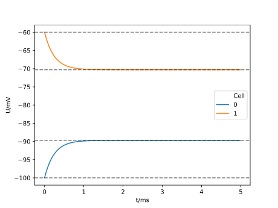

.. _tutorialtwocellsgapjunction:

Two cells connected via a gap junction
==============================

In this example, we will set up two cells connected via a gap junction.
The cells have different leak potentials.
We will investigate how the equilibrium potentials of the two cells change because of the gap junction connection.

.. Note::

   **Concepts covered in this example:**

   1. Creating a simulation recipe for two cells.
   2. Placing probes.
   3. Running the simulation and extracting the results.
   4. Investigating the influence of the cell and gap junction parameters.

The full code
*************

You can find the full code of the example at ``python/examples/two_cell_gap_junctions.py``

Executing the script will run the simulation with default parameters.

Walk-through
************

We set up a recipe for the simulation of two cells with some parameters.

.. literalinclude:: ../../python/example/two_cell_gap_junctions.py
   :language: python
   :lines: 12-48

Implementing the ``cell_description`` member function constructs the morphology and sets the properties of the cells as well as the gap junction and the discretization policy.

.. literalinclude:: ../../python/example/two_cell_gap_junctions.py
   :language: python
   :lines: 61-93

We parse the command line arguments, instantiate the recipe, run the simulation, extract results and plot:

.. literalinclude:: ../../python/example/two_cell_gap_junctions.py
   :language: python
   :lines: 108-187

The output plot below shows how the potential of the two cells approaches their equilibrium potentials.

The equivalent circuit used to calculate the equilibrium potentials is depicted below.

.. figure:: gap_junction_circuit.svg
    :width: 800
    :align: center
