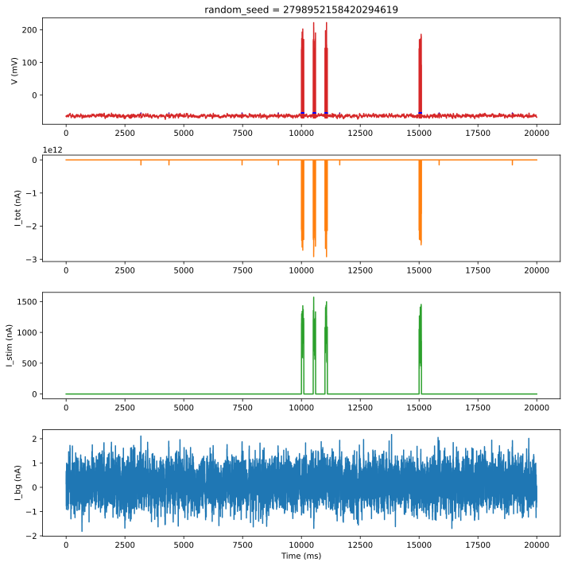

# Ornstein-Uhlenbeck input to LIF neuron

This example is taken from [Jannik Luboeinski's repo](https://github.com/jlubo/arbor_ou_lif_example)
and adapted for inclusion into Arbor.

The simulation consists of a single compartment cable cell with simple leaky integrate-and-fire (LIF)
dynamics with Ornstein-Uhlenbeck (OU) input current. The OU input current can approximate the
synaptic input from a population of neurons. This is mathematically based on the diffusion
approximation, which analytically describes the input current that arises from presynaptic Poisson
spiking if the spiking activity is sufficiently high and the evoked postsynaptic potentials are
sufficiently small compared to the threshold potential [1,2]. Moreover, the exponentially decaying
autocorrelation function of the OU process resembles that of currents evoked by the spiking activity
of many neocortical neurons [3].

Here, we use the Ornstein-Uhlenbeck process in the following form, `dI/dt = -(1/τ) * (I - μ) +
√(2/τ) * σ * W`.  Assuming homogeneous Poisson spiking at frequency *f* for a putative population of
*N* neurons, the mean current is `μ = N * f * w_out`, and the volatility (standard
deviation) is `σ = √(10^3*N*f/(2*τ))*w_out` where *f* is the firing rate in Hertz, *w_out* is the
synaptic weight in nC, and *τ* is the synaptic time constant in ms (cf. [4, 5]).

## References:

[1] Ricciardi, LM. 1977. _Diffusion Processes and Related Topics in Biology_.
Springer, Berlin, Germany.

[2] Moreno-Bote, R; Parga, N. 2010. Response of integrate-and-fire neurons to noisy inputs filtered
by synapses with arbitrary timescales: Firing rate and correlations. _Neural Comput._ 22.

[3] Destexhe, A; Rudolph, M; Paré, D. 2003. The high-conductance state of neocortical neurons in
vivo. _Nat. Rev. Neurosci._ 4.

[4] Dayan, P; Abbott, LF. 2001. _Theoretical Neuroscience_. MIT Press, Cambridge/MA, USA.

[5] Luboeinski, J; Tetzlaff, C. 2021. Memory consolidation and improvement by synaptic tagging and
capture in recurrent neural networks. _Commun. Biol._ 275.
